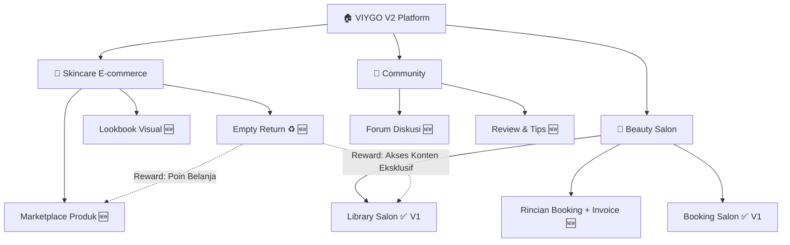
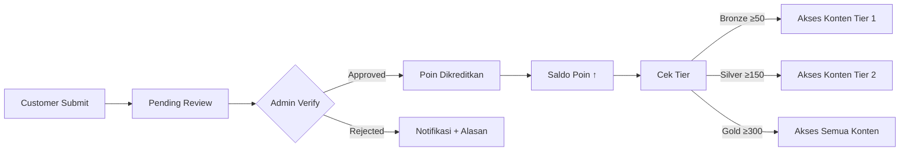
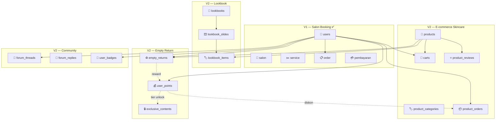
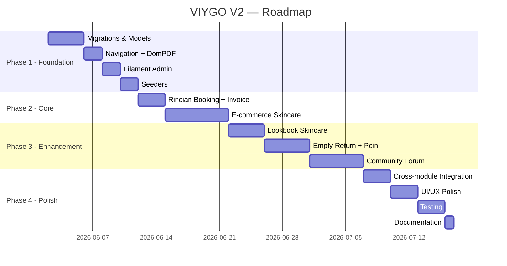

# 📋 VIYGO V2 — Product Requirements Document (PRD)

> **Versi:** 2.0  
> **Tanggal:** 27 Mei 2026  
> **Status:** Draft — Menunggu Review  
> **Platform:** Laravel 12 + Livewire Flux + TailwindCSS v4  
> **Nama Proyek:** VIYGO — Beauty, Skincare & Lifestyle Platform

---

## Daftar Isi

1. [Visi Produk](#1-visi-produk)
2. [Ringkasan Fitur V2](#2-ringkasan-fitur-v2)
3. [Analisis Gap dari V1](#3-analisis-gap-dari-v1)
4. [Modul 1 — E-commerce Skincare](#4-modul-1--e-commerce-skincare)
5. [Modul 2 — Lookbook Skincare](#5-modul-2--lookbook-skincare)
6. [Modul 3 — Skincare Empty Return (Peduli Lingkungan)](#6-modul-3--skincare-empty-return-peduli-lingkungan)
7. [Modul 4 — Digital Library Community](#7-modul-4--digital-library-community)
8. [Modul 5 — Halaman Rincian Booking & Invoice PDF](#8-modul-5--halaman-rincian-booking--invoice-pdf)
9. [Database Schema (Tambahan V2)](#9-database-schema-tambahan-v2)
10. [API Routes (Tambahan V2)](#10-api-routes-tambahan-v2)
11. [Responsive & Mobile Design](#11-responsive--mobile-design)
12. [Non-Functional Requirements](#12-non-functional-requirements)
13. [Roadmap Implementasi](#13-roadmap-implementasi)
14. [Metrik Keberhasilan](#14-metrik-keberhasilan)

---

## 1. Visi Produk

VIYGO V2 bertransformasi dari **salon booking marketplace** menjadi **Beauty & Skincare Lifestyle Platform** yang menyatukan tiga pilar:



**Tagline:** *"Beauty meets sustainability — rawat kulit, jaga bumi."*

**Value Proposition:**
- Pelanggan bisa **booking salon** (✅ sudah ada) sekaligus **membeli produk skincare** baru melalui marketplace
- **Lookbook** visual menampilkan produk skincare dalam format editorial yang menginspirasi
- Program **Empty Return** mendorong sustainability — kembalikan botol kosong, dapatkan poin belanja & akses konten eksklusif
- **Forum komunitas** untuk berbagi tips skincare dan ulasan produk

---

## 2. Ringkasan Fitur V2

| # | Modul | Deskripsi Singkat | Status |
|---|-------|-------------------|--------|
| — | **Library Salon** (listing salon) | Daftar salon, pencarian, kategori, detail salon, map | ✅ **Sudah Ada di V1** |
| — | **Booking Salon** | 3-step booking, konfirmasi, payment Midtrans | ✅ **Sudah Ada di V1** |
| 1 | **E-commerce Skincare** | Marketplace produk skincare: katalog, cart, checkout, payment | 🆕 Prioritas Tinggi |
| 2 | **Lookbook Skincare** | Galeri visual/editorial produk skincare — inspirasi routine | 🆕 Prioritas Sedang |
| 3 | **Skincare Empty Return** | Pengembalian botol kosong untuk daur ulang → poin + akses eksklusif | 🆕 Prioritas Sedang |
| 4 | **Digital Library Community** | Forum diskusi: ulasan produk, tips skincare, sharing routine | 🆕 Prioritas Sedang |
| 5 | **Rincian Booking + Invoice PDF** | Halaman detail pesanan booking + download invoice PDF | 🆕 Prioritas Tinggi |

---

## 3. Analisis Gap dari V1

### Fitur V1 yang Sudah Selesai

| Fitur | File Kunci |
|-------|------------|
| Homepage + Search | [HomeController](file:///d:/VIYGO-V2/au123-pk6m/app/Http/Controllers/HomeController.php), [SearchController](file:///d:/VIYGO-V2/au123-pk6m/app/Http/Controllers/SearchController.php) |
| Library Salon (listing) | [SalonController](file:///d:/VIYGO-V2/au123-pk6m/app/Http/Controllers/SalonController.php) |
| Kategori & Sub-kategori | [KategoriController](file:///d:/VIYGO-V2/au123-pk6m/app/Http/Controllers/KategoriController.php) |
| Salon Detail + Leaflet Map | Route `salon.show` |
| Booking 3-step + Konfirmasi | [BookingController](file:///d:/VIYGO-V2/au123-pk6m/app/Http/Controllers/BookingController.php) |
| Payment Midtrans | [PaymentController](file:///d:/VIYGO-V2/au123-pk6m/app/Http/Controllers/PaymentController.php) |
| Review & Rating | [ReviewController](file:///d:/VIYGO-V2/au123-pk6m/app/Http/Controllers/ReviewController.php) |
| Promo Code | [Promo](file:///d:/VIYGO-V2/au123-pk6m/app/Models/Promo.php) model |
| Akun Dashboard + Favorit | [AkunController](file:///d:/VIYGO-V2/au123-pk6m/app/Http/Controllers/AkunController.php) |
| Filament Admin + Owner Panel | `app/Filament/` |
| Mitra Application | [MitraController](file:///d:/VIYGO-V2/au123-pk6m/app/Http/Controllers/MitraController.php) |

### Gap yang Diisi V2

| Gap | Modul V2 |
|-----|----------|
| Tidak ada fitur jual produk skincare | Modul 1 — E-commerce |
| Tidak ada lookbook / galeri visual produk | Modul 2 — Lookbook |
| Tidak ada program sustainability / green initiative | Modul 3 — Empty Return |
| Tidak ada community / forum diskusi | Modul 4 — Community |
| Halaman konfirmasi booking kurang detail, tidak ada invoice | Modul 5 — Rincian Booking |

---

## 4. Modul 1 — E-commerce Skincare

### 4.1 Deskripsi

Marketplace produk skincare terintegrasi dalam platform VIYGO. Pelanggan bisa browsing, membeli, dan membayar produk skincare. Payment flow menggunakan Midtrans Snap (reuse dari V1).

### 4.2 User Stories

| ID | As a… | I want to… | So that… |
|----|-------|-----------|----------|
| EC-01 | Customer | Browsing produk skincare berdasarkan kategori, brand, tipe kulit | Saya menemukan produk yang cocok |
| EC-02 | Customer | Menambahkan produk ke keranjang belanja | Saya bisa beli beberapa produk sekaligus |
| EC-03 | Customer | Checkout dan membayar via Midtrans | Pembelian selesai dengan aman |
| EC-04 | Customer | Melihat riwayat pesanan produk | Saya bisa tracking status pesanan |
| EC-05 | Customer | Memberikan review produk yang sudah dibeli | Pelanggan lain bisa tahu kualitas produk |
| EC-06 | Customer | Menggunakan poin (dari Empty Return) untuk diskon | Saya dapat benefit dari poin |
| EC-07 | Customer | Menggunakan kode promo di checkout | Saya dapat potongan harga |
| EC-08 | Admin | Mengelola master data produk (CRUD) | Katalog selalu up-to-date |

### 4.3 Fitur Detail

#### 4.3.1 Katalog Produk

- **`/shop`** — halaman utama: produk featured, kategori, promo aktif
- **`/shop/kategori/{slug}`** — filter per kategori (Cleanser, Toner, Serum, Moisturizer, Sunscreen, Masker, dll.)
- **`/shop/produk/{slug}`** — detail produk: gallery gambar, deskripsi, ingredients, cara pakai, harga, rating, reviews
- **Pencarian** produk dengan autocomplete
- **Filter & sort:** harga, rating, terlaris, terbaru, tipe kulit (oily, dry, combination, sensitive, normal, all)

#### 4.3.2 Keranjang Belanja (Cart)

- Tambah / hapus / ubah qty di cart
- Cart **tersimpan di database** (persisten antar-device)
- Tampilkan subtotal, diskon, grand total
- Bisa apply **kode promo** (reuse logic `Promo` model V1)
- Bisa gunakan **poin** (dari Empty Return) sebagai potongan

#### 4.3.3 Checkout & Payment

- Alamat pengiriman (user bisa simpan multiple alamat)
- Pilihan metode pengiriman (biaya diatur admin per kota)
- Ringkasan pesanan sebelum bayar
- **Midtrans Snap** (reuse flow dari V1 `PaymentController`)
- Status pesanan: `pending` → `paid` → `processing` → `shipped` → `delivered` → `completed`

#### 4.3.4 Review Produk

- Customer yang sudah membeli & menerima produk bisa review
- Rating 1–5 bintang + teks review + foto opsional
- Rata-rata rating auto-calculated

### 4.4 Technical Specification

#### Database Tables

```
product_categories
├── id_product_category (PK)
├── nama
├── slug (unique)
├── deskripsi (text, nullable)
├── icon_url (nullable)
├── parent_id (FK → self, nullable)
├── sort_order (integer, default 0)
├── created_at / updated_at

products
├── id_product (PK)
├── id_product_category (FK)
├── nama
├── slug (unique)
├── deskripsi (text)
├── ingredients (text, nullable)
├── cara_pemakaian (text, nullable)
├── harga (decimal 10,2)
├── harga_diskon (decimal 10,2, nullable)
├── stok (integer)
├── berat_gram (integer)
├── skin_type (enum: 'all','oily','dry','combination','sensitive','normal')
├── brand (varchar)
├── rating (decimal 3,2, default 0)
├── total_review (integer, default 0)
├── total_sold (integer, default 0)
├── status (enum: 'active','inactive','out_of_stock')
├── is_featured (boolean, default false)
├── created_at / updated_at

product_images
├── id_product_image (PK)
├── id_product (FK)
├── image_url
├── is_primary (boolean, default false)
├── sort_order (integer, default 0)
├── created_at / updated_at

carts
├── id_cart (PK)
├── id_user (FK)
├── id_product (FK)
├── qty (integer)
├── created_at / updated_at

user_addresses
├── id_address (PK)
├── id_user (FK)
├── label (varchar — "Rumah", "Kantor")
├── nama_penerima
├── phone
├── alamat_lengkap (text)
├── kota
├── provinsi
├── kode_pos
├── is_default (boolean, default false)
├── created_at / updated_at

product_orders
├── id_product_order (PK)
├── id_user (FK)
├── id_address (FK)
├── id_promo (FK, nullable)
├── kode_order (varchar, unique)
├── subtotal (decimal 10,2)
├── biaya_kirim (decimal 10,2)
├── total_diskon (decimal 10,2, default 0)
├── poin_digunakan (integer, default 0)
├── potongan_poin (decimal 10,2, default 0)
├── grand_total (decimal 10,2)
├── metode_kirim (varchar)
├── resi (varchar, nullable)
├── status (enum: 'pending','paid','processing','shipped','delivered','completed','cancelled','refunded')
├── catatan (text, nullable)
├── created_at / updated_at

product_order_items
├── id_item (PK)
├── id_product_order (FK)
├── id_product (FK)
├── qty (integer)
├── harga_satuan (decimal 10,2)
├── subtotal (decimal 10,2)
├── created_at / updated_at

product_pembayaran
├── id_pembayaran (PK)
├── id_product_order (FK)
├── id_user (FK)
├── midtrans_order_id (varchar, nullable)
├── midtrans_transaction_id (varchar, nullable)
├── snap_token (varchar, nullable)
├── metode (varchar, nullable)
├── jumlah (decimal 10,2)
├── status (enum: 'pending','success','failed','expired','refund')
├── paid_at (datetime, nullable)
├── created_at / updated_at

product_reviews
├── id_product_review (PK)
├── id_user (FK)
├── id_product (FK)
├── id_product_order (FK)
├── rating (tinyint 1-5)
├── komentar (text, nullable)
├── foto_url (varchar, nullable)
├── created_at / updated_at
```

#### Routes

| Method | URI | Name | Auth |
|--------|-----|------|------|
| GET | `/shop` | `shop.index` | Public |
| GET | `/shop/kategori/{slug}` | `shop.kategori` | Public |
| GET | `/shop/produk/{slug}` | `shop.produk.show` | Public |
| GET | `/shop/cari` | `shop.cari` | Public |
| POST | `/shop/cart/add` | `shop.cart.add` | ✅ |
| PUT | `/shop/cart/update` | `shop.cart.update` | ✅ |
| DELETE | `/shop/cart/remove/{id}` | `shop.cart.remove` | ✅ |
| GET | `/shop/cart` | `shop.cart` | ✅ |
| GET | `/shop/checkout` | `shop.checkout` | ✅ |
| POST | `/shop/checkout` | `shop.checkout.store` | ✅ |
| GET | `/shop/order/{kode}` | `shop.order.show` | ✅ |
| GET | `/shop/order/{kode}/payment` | `shop.order.payment` | ✅ |
| POST | `/shop/order/{kode}/payment/token` | `shop.order.payment.token` | ✅ |
| POST | `/shop/order/{kode}/payment/finish` | `shop.order.payment.finish` | ✅ |
| GET | `/shop/order/{kode}/invoice` | `shop.order.invoice` | ✅ |
| POST | `/shop/produk/{slug}/review` | `shop.produk.review` | ✅ |

#### Controllers Baru

- `ShopController` — katalog, detail produk, pencarian
- `CartController` — CRUD keranjang
- `ProductCheckoutController` — checkout flow + promo + poin
- `ProductOrderController` — riwayat & detail pesanan
- `ProductPaymentController` — Midtrans flow untuk produk
- `ProductReviewController` — submit review

#### Models Baru

- `ProductCategory`, `Product`, `ProductImage`, `Cart`, `UserAddress`, `ProductOrder`, `ProductOrderItem`, `ProductPembayaran`, `ProductReview`

---

## 5. Modul 2 — Lookbook Skincare

### 5.1 Deskripsi

Lookbook adalah **galeri visual/editorial** bertema skincare — mirip majalah kecantikan online. Menampilkan produk dalam konteks lifestyle (morning routine, night care, dll.) dengan link langsung ke halaman produk untuk pembelian.

> [!NOTE]
> Route `/lookbook` sudah ada di V1 tapi kontennya basic. V2 akan **memperkaya konten lookbook** menjadi fokus skincare dan ter-link ke produk e-commerce.

### 5.2 User Stories

| ID | As a… | I want to… | So that… |
|----|-------|-----------|----------|
| LB-01 | Customer | Browsing lookbook bertema (Morning Routine, Night Care, dll.) | Saya mendapat inspirasi skincare routine |
| LB-02 | Customer | Klik produk di lookbook → langsung ke halaman produk | Saya bisa langsung beli |
| LB-03 | Customer | Share lookbook ke sosial media | Saya bisa rekomendasikan ke teman |
| LB-04 | Admin | Membuat & mengelola lookbook | Konten editorial selalu fresh |

### 5.3 Fitur Detail

#### 5.3.1 Halaman Lookbook Index (`/lookbook`)

- Grid layout dengan cover lookbook + efek hover
- Filter: berdasarkan tema (Morning Routine, Night Care, Anti-Aging, Acne Care, dll.)
- Lookbook terbaru ditampilkan di banner atas

#### 5.3.2 Detail Lookbook (`/lookbook/{slug}`)

- Layout editorial full-width dengan gambar besar
- **Carousel / Slide** — setiap lookbook terdiri dari beberapa slide
- Setiap slide berisi:
  - Hero image
  - Judul & deskripsi editorial
  - **Product tags** — produk yang ditampilkan, clickable ke halaman produk di shop
  - Tips skincare terkait
- Tombol **"Shop This Look"** — tambah semua produk di lookbook ke cart
- Tombol **Share** (WhatsApp, Instagram, Twitter)

#### 5.3.3 Integrasi E-commerce

- Setiap `LookbookItem` ter-link ke `Product` → harga & stok real-time
- Badge **"In Stock"** / **"Out of Stock"** pada product tag

### 5.4 Technical Specification

#### Database Tables

```
lookbooks
├── id_lookbook (PK)
├── judul
├── slug (unique)
├── deskripsi (text)
├── cover_url
├── tema (varchar)
├── is_published (boolean, default false)
├── published_at (datetime, nullable)
├── view_count (integer, default 0)
├── created_at / updated_at

lookbook_slides
├── id_slide (PK)
├── id_lookbook (FK)
├── judul (varchar, nullable)
├── deskripsi (text, nullable)
├── image_url
├── tips (text, nullable)
├── sort_order (integer)
├── created_at / updated_at

lookbook_items (pivot: slide ↔ product)
├── id (PK)
├── id_slide (FK)
├── id_product (FK)
├── position_x (decimal — posisi tag di gambar, %)
├── position_y (decimal — posisi tag di gambar, %)
├── created_at / updated_at
```

#### Routes

| Method | URI | Name | Auth |
|--------|-----|------|------|
| GET | `/lookbook` | `lookbook.index` | Public |
| GET | `/lookbook/{slug}` | `lookbook.show` | Public |
| POST | `/lookbook/{slug}/shop-all` | `lookbook.shopAll` | ✅ |

#### Controller & Models

- `LookbookController` (override/extend V1)
- `Lookbook`, `LookbookSlide`, `LookbookItem` models

---

## 6. Modul 3 — Skincare Empty Return (Peduli Lingkungan)

### 6.1 Deskripsi

Program sustainability di mana pelanggan **mengembalikan botol/kemasan kosong skincare** untuk didaur ulang. Sebagai imbalannya:

1. **Poin belanja** — digunakan sebagai potongan harga di shop skincare
2. **Akses ke koleksi konten eksklusif** — artikel premium, video tutorial, dan tips skincare eksklusif yang hanya bisa diakses melalui program ini

### 6.2 User Stories

| ID | As a… | I want to… | So that… |
|----|-------|-----------|----------|
| ER-01 | Customer | Mendaftarkan pengembalian botol kosong via web | Saya ikut program daur ulang |
| ER-02 | Customer | Upload foto botol kosong sebagai bukti | Proses verifikasi lebih mudah |
| ER-03 | Customer | Memilih metode pengembalian (drop-off di salon / pickup) | Saya pilih cara paling nyaman |
| ER-04 | Customer | Melihat saldo poin dan riwayat | Saya tahu berapa poin yang saya punya |
| ER-05 | Customer | Menukarkan poin untuk diskon belanja | Saya dapat benefit dari program |
| ER-06 | Customer | Mengakses konten eksklusif setelah mencapai tier tertentu | Saya dapat reward non-monetary |
| ER-07 | Admin | Memverifikasi dan approve/reject pengembalian | Program tidak disalahgunakan |
| ER-08 | Admin | Mengatur poin per jenis produk | Kontrol reward yang fleksibel |
| ER-09 | Salon Owner | Menerima drop-off botol dan konfirmasi penerimaan | Proses logistik berjalan lancar |

### 6.3 Fitur Detail

#### 6.3.1 Landing Page (`/empty-return`)

- Penjelasan program: alur, benefit, dan dampak lingkungan
- **Counter real-time:** Total botol dikembalikan di seluruh platform
- **Impact meter:** Estimasi pengurangan sampah plastik (kg)
- CTA: "Kembalikan Botol Sekarang"

#### 6.3.2 Form Pengajuan Pengembalian

- Pilih produk yang dikembalikan (dari riwayat pembelian, atau input manual)
- Jumlah botol/kemasan
- Upload foto botol kosong (maks 3 foto)
- Pilih metode pengembalian:
  - **Drop-off di Salon** — pilih salon terdekat
  - **Pickup** — isi alamat (placeholder untuk future)
- Estimasi poin yang didapat (real-time)

#### 6.3.3 Alur Verifikasi



#### 6.3.4 Sistem Poin & Tier

| Tier | Poin Minimum | Benefit |
|------|-------------|---------|
| **Starter** | 0 | Submit pengembalian, dapat poin |
| **Bronze 🥉** | 50 | + Akses 5 konten eksklusif |
| **Silver 🥈** | 150 | + Akses 15 konten eksklusif + Free shipping 1x/bulan |
| **Gold 🥇** | 300 | + Akses semua konten eksklusif + Free shipping unlimited |

**Konversi Poin:**
- 1 poin = Rp 1.000 potongan harga di shop
- Poin per botol: default 5 poin (kecil), 10 poin (besar) — bisa diatur admin

#### 6.3.5 Konten Eksklusif

- Artikel premium tentang skincare routine
- Video tutorial perawatan kulit
- Tips & trik dari beauty expert
- Early access ke produk baru
- Dikelola admin melalui Filament panel

#### 6.3.6 Dashboard Poin Customer (`/akun/poin`)

- Saldo poin + tier saat ini
- Progress bar ke tier berikutnya
- Riwayat perolehan poin
- Riwayat pemakaian poin
- Quick link ke konten eksklusif yang bisa diakses

### 6.4 Technical Specification

#### Database Tables

```
empty_returns
├── id_return (PK)
├── id_user (FK)
├── id_product (FK, nullable — dari katalog)
├── id_salon (FK, nullable — salon drop-off)
├── nama_produk (varchar — untuk input manual)
├── jumlah (integer)
├── metode (enum: 'dropoff','pickup')
├── alamat_pickup (text, nullable)
├── status (enum: 'pending','approved','rejected','picked_up','received')
├── poin_earned (integer, default 0)
├── catatan_admin (text, nullable)
├── verified_by (FK → users, nullable)
├── verified_at (datetime, nullable)
├── created_at / updated_at

empty_return_photos
├── id (PK)
├── id_return (FK)
├── photo_url
├── created_at / updated_at

user_points
├── id (PK)
├── id_user (FK, unique)
├── saldo (integer, default 0)
├── total_earned (integer, default 0)
├── total_spent (integer, default 0)
├── tier (enum: 'starter','bronze','silver','gold')
├── created_at / updated_at

point_transactions
├── id (PK)
├── id_user (FK)
├── type (enum: 'earn','spend')
├── amount (integer)
├── source (varchar — 'empty_return','purchase_discount','bonus')
├── reference_id (integer, nullable)
├── reference_type (varchar, nullable — polymorphic)
├── description (varchar)
├── saldo_after (integer)
├── created_at / updated_at

exclusive_contents
├── id_content (PK)
├── judul
├── slug (unique)
├── tipe (enum: 'article','video','tip')
├── konten (longtext — untuk article/tip)
├── video_url (varchar, nullable)
├── thumbnail_url (nullable)
├── min_tier (enum: 'bronze','silver','gold')
├── is_published (boolean, default false)
├── created_at / updated_at
```

#### Routes

| Method | URI | Name | Auth |
|--------|-----|------|------|
| GET | `/empty-return` | `emptyReturn.index` | Public |
| GET | `/empty-return/submit` | `emptyReturn.create` | ✅ |
| POST | `/empty-return/submit` | `emptyReturn.store` | ✅ |
| GET | `/empty-return/riwayat` | `emptyReturn.history` | ✅ |
| GET | `/akun/poin` | `akun.poin` | ✅ |
| GET | `/akun/poin/riwayat` | `akun.poin.history` | ✅ |
| GET | `/eksklusif` | `exclusive.index` | ✅ |
| GET | `/eksklusif/{slug}` | `exclusive.show` | ✅ |

#### Controllers & Models

- `EmptyReturnController`
- `PointController`
- `ExclusiveContentController`
- `EmptyReturn`, `EmptyReturnPhoto`, `UserPoint`, `PointTransaction`, `ExclusiveContent` models

---

## 7. Modul 4 — Digital Library Community

### 7.1 Deskripsi

Forum diskusi online yang terintegrasi di web VIYGO. Pengguna bisa saling **mengulas produk skincare**, **berbagi tips perawatan kulit**, dan **sharing routine**. Forum ini menjadi sarana belajar bersama secara informal.

### 7.2 User Stories

| ID | As a… | I want to… | So that… |
|----|-------|-----------|----------|
| DC-01 | Customer | Membuat thread diskusi tentang skincare | Saya berbagi pengetahuan |
| DC-02 | Customer | Membalas thread orang lain | Saya ikut diskusi |
| DC-03 | Customer | Melihat thread per kategori (Tips, Routine, Review, dll.) | Saya temukan topik menarik |
| DC-04 | Customer | Like/upvote thread dan balasan yang bermanfaat | Konten berkualitas lebih terlihat |
| DC-05 | Customer | Bookmark thread yang menarik | Saya bisa kembali baca nanti |
| DC-06 | Admin | Menghapus/menyembunyikan thread yang melanggar aturan | Komunitas tetap positif |

### 7.3 Fitur Detail

#### 7.3.1 Halaman Forum Utama (`/komunitas`)

**Kategori forum:**

| Kategori | Deskripsi |
|----------|-----------|
| 🧴 Review Produk | Ulasan dan diskusi produk skincare |
| 💡 Tips Skincare | Tips dan rekomendasi perawatan kulit |
| 🌿 Routine & Lifestyle | Sharing daily skincare routine |
| ♻️ Peduli Lingkungan | Diskusi sustainability, daur ulang |
| 💬 Diskusi Umum | Topik bebas terkait beauty & wellness |

- Thread terbaru & trending di home forum
- Search bar
- Statistik komunitas: total member, total thread, total reply

#### 7.3.2 Detail Thread (`/komunitas/thread/{slug}`)

- Isi thread (rich text)
- Info author (avatar, nama, jumlah kontribusi)
- Views, likes, replies count
- Daftar balasan (nested max 2 level)
- Form balasan
- Tombol: Like, Bookmark, Share, Report

#### 7.3.3 Membuat Thread (`/komunitas/thread/buat`)

- Form: Judul, Kategori, Konten (rich text)
- Tag produk terkait (opsional — link ke halaman produk di shop)
- Preview sebelum publish

#### 7.3.4 Gamification

| Aksi | Poin Komunitas |
|------|---------------|
| Buat thread | +5 |
| Dapat reply | +1 |
| Dapat like | +2 |

**Badge:**
- 🧴 "Skincare Guru" — 20+ tips
- ⭐ "Top Reviewer" — 10+ review produk
- ♻️ "Eco Warrior" — 5+ empty return
- 🔥 "Rising Star" — 50+ poin komunitas

**Leaderboard** bulanan: Top 10 kontributor

### 7.4 Technical Specification

#### Database Tables

```
forum_categories
├── id_forum_category (PK)
├── nama
├── slug (unique)
├── deskripsi (text, nullable)
├── icon (varchar, nullable)
├── sort_order (integer, default 0)
├── created_at / updated_at

forum_threads
├── id_thread (PK)
├── id_user (FK)
├── id_forum_category (FK)
├── judul
├── slug (unique)
├── konten (longtext)
├── view_count (integer, default 0)
├── like_count (integer, default 0)
├── reply_count (integer, default 0)
├── is_pinned (boolean, default false)
├── is_locked (boolean, default false)
├── status (enum: 'published','hidden','deleted')
├── created_at / updated_at

forum_replies
├── id_reply (PK)
├── id_thread (FK)
├── id_user (FK)
├── parent_id (FK → self, nullable — nested reply)
├── konten (text)
├── like_count (integer, default 0)
├── status (enum: 'published','hidden','deleted')
├── created_at / updated_at

forum_likes (polymorphic)
├── id (PK)
├── id_user (FK)
├── likeable_type (varchar — 'forum_thread'/'forum_reply')
├── likeable_id (integer)
├── created_at
UNIQUE: (id_user, likeable_type, likeable_id)

forum_bookmarks
├── id (PK)
├── id_user (FK)
├── id_thread (FK)
├── created_at
UNIQUE: (id_user, id_thread)

forum_thread_tags (pivot: thread ↔ products)
├── id (PK)
├── id_thread (FK)
├── id_product (FK)
├── created_at / updated_at

user_badges
├── id (PK)
├── id_user (FK)
├── badge_slug (varchar)
├── earned_at (datetime)
├── created_at / updated_at

community_points
├── id (PK)
├── id_user (FK, unique)
├── total_points (integer, default 0)
├── created_at / updated_at
```

#### Routes

| Method | URI | Name | Auth |
|--------|-----|------|------|
| GET | `/komunitas` | `komunitas.index` | Public |
| GET | `/komunitas/{kategori}` | `komunitas.kategori` | Public |
| GET | `/komunitas/thread/{slug}` | `komunitas.thread.show` | Public |
| GET | `/komunitas/thread/buat` | `komunitas.thread.create` | ✅ |
| POST | `/komunitas/thread` | `komunitas.thread.store` | ✅ |
| POST | `/komunitas/thread/{slug}/reply` | `komunitas.reply.store` | ✅ |
| POST | `/komunitas/thread/{slug}/like` | `komunitas.thread.like` | ✅ |
| POST | `/komunitas/reply/{id}/like` | `komunitas.reply.like` | ✅ |
| POST | `/komunitas/thread/{slug}/bookmark` | `komunitas.thread.bookmark` | ✅ |
| GET | `/komunitas/leaderboard` | `komunitas.leaderboard` | Public |
| GET | `/akun/bookmarks` | `akun.bookmarks` | ✅ |

#### Controllers & Models

- `ForumController`, `ForumReplyController`, `ForumInteractionController`
- `ForumCategory`, `ForumThread`, `ForumReply`, `ForumLike`, `ForumBookmark`, `ForumThreadTag`, `UserBadge`, `CommunityPoint` models

---

## 8. Modul 5 — Halaman Rincian Booking & Invoice PDF

### 8.1 Deskripsi

Halaman detail pesanan booking yang lengkap + **download invoice dalam format PDF**.

### 8.2 User Stories

| ID | As a… | I want to… | So that… |
|----|-------|-----------|----------|
| BD-01 | Customer | Melihat rincian booking lengkap | Saya periksa detail (service, waktu, harga, status) |
| BD-02 | Customer | Download invoice PDF | Saya punya bukti pembayaran yang bisa dicetak |
| BD-03 | Customer | Melihat timeline status booking | Saya tahu progress dari awal sampai selesai |

### 8.3 Fitur Detail

#### 8.3.1 Halaman Rincian Booking (`/akun/bookings/{kode}`)

**Header:**
- Kode order (prominent)
- Status badge (warna: pending=kuning, confirmed=biru, success=hijau, cancelled=merah)
- Tanggal booking

**Informasi Salon:**
- Nama salon + link ke halaman salon
- Alamat & telepon
- Mini map (Leaflet)

**Rincian Service:**

| Service | Staff | Durasi | Harga |
|---------|-------|--------|-------|
| Hair Coloring | Sarah | 90 min | £85.00 |
| Blow Dry | Emma | 30 min | £35.00 |

- Catatan khusus (field `catatan` dari `order_detail`)

**Ringkasan Pembayaran:**
- Subtotal
- Diskon (jika ada promo)
- **Total Pembayaran** (bold)
- Metode pembayaran & status
- ID Transaksi Midtrans (jika ada)

**Timeline Status:**
```
● Booking Dibuat      — 27 Mei 2026, 14:00
● Pembayaran Berhasil — 27 Mei 2026, 14:05
● Dikonfirmasi Salon  — 27 Mei 2026, 15:30
○ Treatment Selesai   — (menunggu)
```

**Aksi:**
- 📄 **Download Invoice PDF**
- ❌ **Batalkan Booking** — hanya jika status `pending` / `confirmed`
- ⭐ **Tulis Review** — hanya jika status `success` / `completed`

#### 8.3.2 Invoice PDF

**Konten:**
- **Header:** Logo VIYGO, "INVOICE", Nomor Invoice (= kode_order)
- **Info Pelanggan:** Nama, email, telepon
- **Info Salon:** Nama, alamat
- **Tabel Service:** No, Nama Service, Staff, Durasi, Harga
- **Ringkasan:** Subtotal, Diskon, Total
- **Info Pembayaran:** Metode, status, tanggal bayar
- **Footer:** "Terima kasih telah menggunakan VIYGO", tanggal cetak

**Technical:**
- Package: **`barryvdh/laravel-dompdf`**
- Template: `resources/views/pdf/invoice-booking.blade.php`
- PDF di-generate on-demand, stream ke browser (tidak disimpan)
- Filename: `VIYGO-Invoice-{kode_order}.pdf`

### 8.4 Technical Specification

#### Routes

| Method | URI | Name | Auth |
|--------|-----|------|------|
| GET | `/akun/bookings/{kode}` | `akun.booking.detail` | ✅ (customer) |
| GET | `/akun/bookings/{kode}/invoice` | `akun.booking.invoice` | ✅ (customer) |

#### Controller Updates

- Tambah method di [AkunController](file:///d:/VIYGO-V2/au123-pk6m/app/Http/Controllers/AkunController.php):
  - `bookingDetail($kode)` — tampilkan halaman rincian
  - `downloadInvoice($kode)` — generate & stream PDF

#### Views Baru

- `resources/views/akun/booking-detail.blade.php`
- `resources/views/pdf/invoice-booking.blade.php`

#### Package Baru

- `barryvdh/laravel-dompdf` — PDF generation

---

## 9. Database Schema (Tambahan V2)

### Ringkasan Tabel Baru

| # | Tabel | Modul | Deskripsi |
|---|-------|-------|-----------|
| 1 | `product_categories` | E-commerce | Kategori produk skincare |
| 2 | `products` | E-commerce | Master data produk |
| 3 | `product_images` | E-commerce | Gambar produk |
| 4 | `carts` | E-commerce | Keranjang belanja |
| 5 | `user_addresses` | E-commerce | Alamat pengiriman |
| 6 | `product_orders` | E-commerce | Pesanan produk |
| 7 | `product_order_items` | E-commerce | Detail item pesanan |
| 8 | `product_pembayaran` | E-commerce | Pembayaran produk (Midtrans) |
| 9 | `product_reviews` | E-commerce | Review produk |
| 10 | `lookbooks` | Lookbook | Master data lookbook |
| 11 | `lookbook_slides` | Lookbook | Slide dalam lookbook |
| 12 | `lookbook_items` | Lookbook | Pivot: slide ↔ produk |
| 13 | `empty_returns` | Empty Return | Record pengembalian botol |
| 14 | `empty_return_photos` | Empty Return | Foto bukti |
| 15 | `user_points` | Empty Return | Saldo poin user |
| 16 | `point_transactions` | Empty Return | Log transaksi poin |
| 17 | `exclusive_contents` | Empty Return | Konten eksklusif per tier |
| 18 | `forum_categories` | Community | Kategori forum |
| 19 | `forum_threads` | Community | Thread diskusi |
| 20 | `forum_replies` | Community | Balasan thread |
| 21 | `forum_likes` | Community | Like (polymorphic) |
| 22 | `forum_bookmarks` | Community | Bookmark thread |
| 23 | `forum_thread_tags` | Community | Tag produk di thread |
| 24 | `user_badges` | Community | Badge gamification |
| 25 | `community_points` | Community | Poin kontribusi |

**Total tabel baru: 25 tabel**

### ER Diagram V2



---

## 10. API Routes (Tambahan V2)

### Ringkasan

| Modul | Jumlah Route | Prefix |
|-------|-------------|--------|
| E-commerce Skincare | 16 routes | `/shop` |
| Lookbook Skincare | 3 routes | `/lookbook` |
| Empty Return | 8 routes | `/empty-return`, `/akun/poin`, `/eksklusif` |
| Digital Library Community | 11 routes | `/komunitas`, `/akun/bookmarks` |
| Rincian Booking + Invoice | 2 routes | `/akun/bookings/{kode}` |
| **Total** | **~40 routes** | |

### Navigasi Utama V2

```
┌────────────────────────────────────────────────────────────────┐
│  🏠 Home  │  🔍 Cari Salon  │  🧴 Shop  │  📸 Lookbook       │
│  💬 Komunitas  │  ♻️ Empty Return                             │
└────────────────────────────────────────────────────────────────┘
```

**Menu Akun:**
```
📊 Dashboard
📋 Booking Saya → Rincian + Invoice
🛒 Pesanan Produk
❤️ Favorit Salon
💰 Poin & Reward
🔖 Bookmark Forum
⚙️ Pengaturan
```

---

## 11. Responsive & Mobile Design

> [!IMPORTANT]
> Semua halaman V2 **wajib responsive dan mobile-friendly**. Pendekatan **mobile-first** — desain dimulai dari layar kecil, lalu scale up ke desktop.

### 11.1 Breakpoints (TailwindCSS v4)

| Breakpoint | Min-Width | Target Device |
|------------|-----------|---------------|
| `sm` | 640px | Smartphone landscape |
| `md` | 768px | Tablet portrait |
| `lg` | 1024px | Tablet landscape / laptop |
| `xl` | 1280px | Desktop |
| `2xl` | 1536px | Desktop besar |

### 11.2 Layout Per Modul

#### E-commerce Skincare (`/shop`)

| Elemen | Mobile (< 640px) | Tablet (768px) | Desktop (1024px+) |
|--------|-------------------|----------------|--------------------|
| Product grid | 2 kolom | 3 kolom | 4 kolom |
| Filter & sort | Bottom sheet (slide up) | Sidebar collapse | Sidebar tetap |
| Product card | Compact: gambar + nama + harga | + rating badge | + quick add to cart |
| Detail produk | Gambar full-width → info di bawah | Side-by-side (50/50) | Side-by-side (40/60) |
| Gallery gambar | Swipeable horizontal carousel | Thumbnail strip + main image | Grid gallery + lightbox |
| Cart | Full-screen page | Slide-in drawer dari kanan | Slide-in drawer dari kanan |
| Checkout | Single-column stacked form | Two-column (form + summary) | Two-column (form + summary) |
| Pencarian | Full-screen overlay | Full-screen overlay | Inline search bar + dropdown |

#### Lookbook (`/lookbook`)

| Elemen | Mobile (< 640px) | Tablet (768px) | Desktop (1024px+) |
|--------|-------------------|----------------|--------------------|
| Lookbook grid | 1 kolom full-width | 2 kolom | 3 kolom |
| Detail slide | Vertical scroll, gambar full-width | Vertical scroll + larger images | Horizontal carousel / slideshow |
| Product tags | Tap to reveal product info popup | Hover + tap | Hover tooltip with product info |
| "Shop This Look" | Sticky button di bawah | Sticky button di bawah | Button di sidebar |

#### Empty Return (`/empty-return`)

| Elemen | Mobile (< 640px) | Tablet (768px) | Desktop (1024px+) |
|--------|-------------------|----------------|--------------------|
| Landing page | Stacked sections, CTA sticky bottom | Two-column hero | Full hero banner |
| Form pengajuan | Single-column, step-by-step wizard | Single-column centered | Two-column (form + preview) |
| Upload foto | Camera capture + gallery picker | Gallery picker | Drag & drop + file picker |
| Dashboard poin | Card stacked vertically | Side-by-side cards | Dashboard grid layout |
| Pilih salon drop-off | List view + map toggle | Split (list + map) | Split (list + map) |

#### Community Forum (`/komunitas`)

| Elemen | Mobile (< 640px) | Tablet (768px) | Desktop (1024px+) |
|--------|-------------------|----------------|--------------------|
| Kategori | Horizontal scroll chips | Grid 2 kolom | Grid 3 kolom + sidebar |
| Thread list | Card list full-width | Card list with sidebar | Card list + sidebar filters |
| Detail thread | Full-width stacked | Full-width stacked | Content + sidebar (related) |
| Reply form | Bottom fixed bar, expand on tap | Inline form | Inline form |
| Rich text editor | Simplified toolbar (bold, italic, list) | Full toolbar | Full toolbar |
| Leaderboard | Compact list (avatar + nama + poin) | Table view | Table view + badge showcase |

#### Rincian Booking (`/akun/bookings/{kode}`)

| Elemen | Mobile (< 640px) | Tablet (768px) | Desktop (1024px+) |
|--------|-------------------|----------------|--------------------|
| Header + status | Stacked (kode → status → tanggal) | Horizontal row | Horizontal row |
| Info salon | Stacked, map di bawah | Side-by-side (info + map) | Side-by-side (info + map) |
| Tabel service | Card-based (1 service per card) | Table view | Table view |
| Timeline | Vertical timeline (compact) | Vertical timeline (full) | Horizontal timeline |
| Tombol aksi | Sticky bottom bar | Inline buttons | Inline buttons |
| Invoice PDF | Download button (opens in browser) | Download button | Download / preview inline |

### 11.3 Navigasi Mobile

```
┌─────────────────────────────────────┐
│  ☰  VIYGO              🔍  🛒  👤  │  ← Top bar (fixed)
├─────────────────────────────────────┤
│                                     │
│         [Page Content]              │
│                                     │
├─────────────────────────────────────┤
│  🏠    🧴    📸    💬    👤        │  ← Bottom tab bar (fixed)
│ Home  Shop  Look  Forum  Akun      │
└─────────────────────────────────────┘
```

**Detail:**
- **Top bar (fixed):** Logo + hamburger menu (☰) + search icon + cart badge + profile
- **Bottom tab bar (fixed):** 5 tab utama — Home, Shop, Lookbook, Komunitas, Akun
- **Hamburger menu:** Slide-in drawer berisi: Cari Salon, Empty Return, Konten Eksklusif, Poin & Reward, dll.
- Bottom tab bar hanya muncul di **mobile** (< 768px), di tablet/desktop menggunakan top navbar horizontal

### 11.4 Touch & Gesture

| Gesture | Aksi |
|---------|------|
| Swipe left/right | Navigasi slide lookbook, gallery produk |
| Swipe down | Pull-to-refresh pada list (thread, produk, booking) |
| Long press | Quick action menu (share, bookmark, add to cart) |
| Pinch-to-zoom | Zoom gambar produk di detail |
| Tap & hold on product tag | Show product info popup di lookbook |

### 11.5 Mobile-Specific UX

| Pattern | Implementasi |
|---------|--------------|
| **Skeleton loading** | Placeholder shimmer saat data loading (produk, thread) |
| **Infinite scroll** | Produk list, thread list — load lebih banyak saat scroll bawah |
| **Sticky elements** | Cart total di checkout, CTA buttons, bottom tab bar |
| **Toast notification** | "Ditambahkan ke keranjang", "Poin berhasil digunakan" |
| **Sheet / modal** | Filter, sort, login prompt — slide up dari bawah |
| **Optimistic UI** | Like, bookmark — update UI langsung, sync ke server di background |
| **Offline indicator** | Banner "Anda sedang offline" saat koneksi terputus |

### 11.6 Image Handling Mobile

| Teknik | Detail |
|--------|--------|
| **Responsive images** | `srcset` + `sizes` attribute — serve ukuran gambar sesuai viewport |
| **Lazy loading** | `loading="lazy"` pada semua gambar di bawah fold |
| **Format** | WebP sebagai default, JPEG sebagai fallback |
| **Thumbnail** | Produk list: 300px, Detail: 800px, Lookbook: 1200px |
| **Placeholder** | Low-quality image placeholder (LQIP) blur effect saat loading |

### 11.7 Invoice PDF Mobile

- PDF tetap A4 portrait (standar invoice)
- Tombol **"Download PDF"** memicu download langsung ke device
- Pada mobile, PDF dibuka di browser built-in PDF viewer atau di-download
- Alternatif: tampilkan **versi web** dari invoice (HTML) yang bisa di-screenshot

---

## 12. Non-Functional Requirements

### Performance

| Metric | Target |
|--------|--------|
| Time to First Byte (TTFB) | < 500ms |
| Largest Contentful Paint (LCP) | < 2.5s (desktop), < 3.5s (mobile 4G) |
| First Input Delay (FID) | < 100ms |
| Cumulative Layout Shift (CLS) | < 0.1 |
| Database queries per page | < 15 (eager loading) |
| Image optimization | WebP, lazy loading, responsive srcset |
| PDF generation | < 3s per invoice |
| Mobile page weight | < 1.5MB (initial load, sebelum lazy content) |

### Security

| Requirement | Implementation |
|-------------|----------------|
| Auth | `auth` + `verified` middleware pada route yang membutuhkan |
| Authorization | Role-based (`customer`, `admin`, `salon_owner`) |
| File upload | Validasi tipe (jpg, png, webp), maks 2MB/file |
| CSRF | Token bawaan Laravel |
| Rate limiting | Submit: 5 req/min, Browse: 30 req/min |
| XSS | HTMLPurifier untuk rich text forum |

### Scalability

| Approach | Detail |
|----------|--------|
| Indexing | Composite index pada FK yang sering di-JOIN |
| Caching | Redis/file cache untuk katalog produk & lookbook (TTL: 15 min) |
| Queue | Email notifikasi & PDF via Laravel Queue |
| Storage | Upload ke local storage (bisa migrasi ke S3/GCS nanti) |

---

## 13. Roadmap Implementasi

### Phase 1 — Foundation (Minggu 1–2)

> [!IMPORTANT]
> Fondasi yang harus selesai terlebih dahulu.

| Task | Estimasi |
|------|----------|
| Database migrations (25 tabel baru) | 2 hari |
| Eloquent Models baru + relationships | 2 hari |
| Update navigasi (navbar + sidebar akun) | 1 hari |
| Install `barryvdh/laravel-dompdf` | 0.5 hari |
| Filament admin resources (Products, Forum moderation) | 2 hari |
| Database seeders (produk, kategori, lookbook dummy) | 1.5 hari |

### Phase 2 — Core (Minggu 3–5)

| Task | Estimasi |
|------|----------|
| **Modul 5** — Rincian Booking + Invoice PDF | 3 hari |
| **Modul 1** — E-commerce Skincare (katalog, cart, checkout, payment) | 7 hari |

### Phase 3 — Enhancement (Minggu 6–8)

| Task | Estimasi |
|------|----------|
| **Modul 2** — Lookbook Skincare | 4 hari |
| **Modul 3** — Empty Return + Poin + Tier + Konten Eksklusif | 5 hari |
| **Modul 4** — Digital Library Community (forum, gamification) | 6 hari |

### Phase 4 — Polish (Minggu 9–10)

| Task | Estimasi |
|------|----------|
| Integrasi cross-module (poin ↔ checkout, tier ↔ konten eksklusif) | 3 hari |
| UI/UX polish, responsive, micro-animations | 3 hari |
| Testing (unit + feature) | 3 hari |
| Documentation update | 1 hari |

**Total: ~10 minggu**



---

## 14. Metrik Keberhasilan

| Metrik | Target |
|--------|--------|
| Conversion rate shop | ≥ 2% visitor → pembelian |
| Empty Return participation | ≥ 10% customer aktif |
| Forum engagement | ≥ 100 thread/bulan (setelah 3 bulan) |
| Invoice download rate | ≥ 60% dari booking completed |
| Lookbook view-to-cart | ≥ 5% viewer tambah produk ke cart |
| Page load (LCP) | < 2.5s |

---

> [!TIP]
> Dokumen ini adalah **living document** — akan di-update seiring development berjalan.

---

**Dibuat oleh:** VIYGO Development Team  
**Tanggal:** 27 Mei 2026
