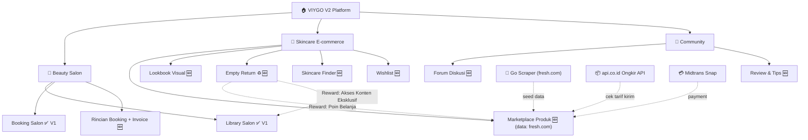
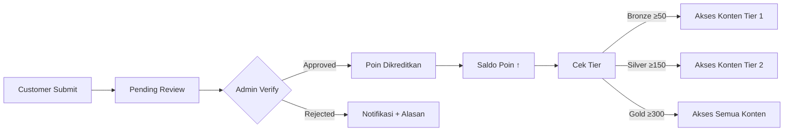
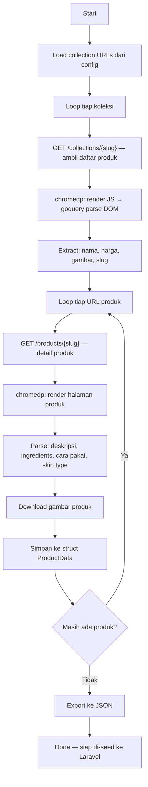
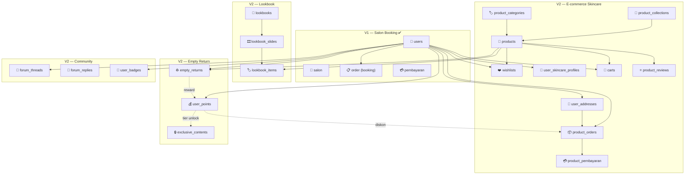
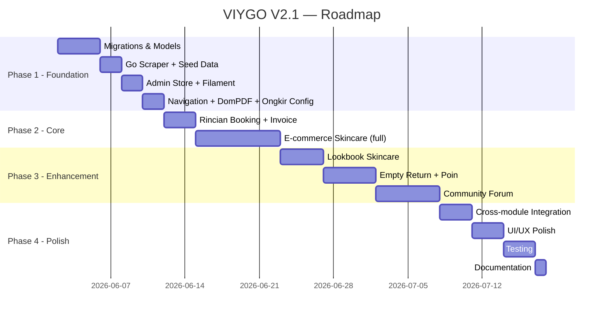
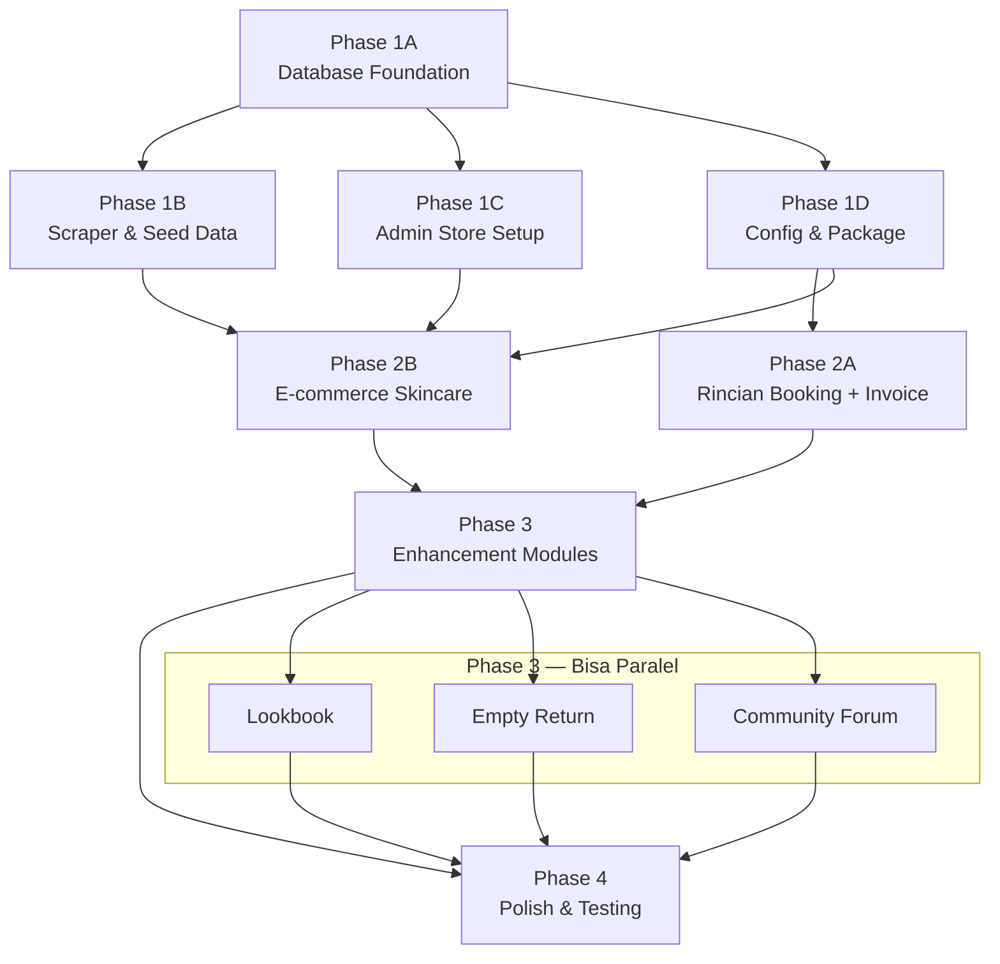

# 📋 VIYGO V2 — Product Requirements Document (PRD)

> **Versi:** 2.3  
> **Tanggal:** 28 Mei 2026  
> **Status:** Draft — Menunggu Review  
> **Platform:** Laravel 12 + Livewire Flux + TailwindCSS v4  
> **Nama Proyek:** VIYGO — Beauty, Skincare & Lifestyle Platform

---

## Daftar Isi

1. [Visi Produk](#1-visi-produk)
2. [Ringkasan Fitur V2](#2-ringkasan-fitur-v2)
3. [Analisis Gap dari V1](#3-analisis-gap-dari-v1)
4. [Modul 1 — E-commerce Skincare](#4-modul-1--e-commerce-skincare)
5. [Modul 2 — Lookbook Skincare](#5-modul-2--lookbook-skincare)
6. [Modul 3 — Skincare Empty Return (Peduli Lingkungan)](#6-modul-3--skincare-empty-return-peduli-lingkungan)
7. [Modul 4 — Digital Library Community](#7-modul-4--digital-library-community)
8. [Modul 5 — Halaman Rincian Booking & Invoice PDF](#8-modul-5--halaman-rincian-booking--invoice-pdf)
9. [Data Source — Fresh.com Scraper](#9-data-source--freshcom-scraper)
10. [Admin Store — CMS E-commerce](#10-admin-store--cms-e-commerce)
11. [Integrasi Ongkir — api.co.id](#11-integrasi-ongkir--apicoid)
12. [Database Schema (Tambahan V2)](#12-database-schema-tambahan-v2)
13. [API Routes (Tambahan V2)](#13-api-routes-tambahan-v2)
14. [Responsive & Mobile Design](#14-responsive--mobile-design)
15. [Non-Functional Requirements](#15-non-functional-requirements)
16. [Roadmap Implementasi](#16-roadmap-implementasi)
17. [Metrik Keberhasilan](#17-metrik-keberhasilan)
18. [Urutan Pengerjaan — Work Order untuk AI Agent](#18-urutan-pengerjaan--work-order-untuk-ai-agent)

---

## 1. Visi Produk

VIYGO V2 bertransformasi dari **salon booking marketplace** menjadi **Beauty & Skincare Lifestyle Platform** yang menyatukan tiga pilar utama, dengan data produk skincare bersumber dari **fresh.com** — brand skincare premium internasional:



**Tagline:** *"Beauty meets sustainability — rawat kulit, jaga bumi."*

**Value Proposition:**
- Katalog produk skincare premium bersumber dari **fresh.com** — brand terpercaya dengan koleksi serum, moisturizer, toner, dan cleanser berbahan alami
- **Ongkos kirim real-time** via api.co.id — mendukung JNE, J&T, SiCepat, Pos Indonesia
- **Skincare Finder** — bantu customer temukan produk berdasarkan skin concern dan skin type (terinspirasi dari fresh.com Skincare Finder)
- Program **Empty Return** mendorong sustainability — kembalikan botol kosong, dapatkan poin belanja

---

## 2. Ringkasan Fitur V2

| # | Modul | Deskripsi Singkat | Status |
|---|-------|-------------------|--------|
| — | **Library Salon** (listing salon) | Daftar salon, pencarian, kategori, detail salon, map | ✅ **Sudah Ada di V1** |
| — | **Booking Salon** | 3-step booking, konfirmasi, payment Midtrans | ✅ **Sudah Ada di V1** |
| 1 | **E-commerce Skincare** | Marketplace produk skincare: katalog fresh.com, cart, checkout, ongkir, payment | 🆕 Prioritas Tinggi |
| 2 | **Lookbook Skincare** | Galeri visual/editorial produk skincare — inspirasi routine | 🆕 Prioritas Sedang |
| 3 | **Skincare Empty Return** | Pengembalian botol kosong untuk daur ulang → poin + akses eksklusif | 🆕 Prioritas Sedang |
| 4 | **Digital Library Community** | Forum diskusi: ulasan produk, tips skincare, sharing routine | 🆕 Prioritas Sedang |
| 5 | **Rincian Booking + Invoice PDF** | Halaman detail pesanan booking + download invoice PDF | 🆕 Prioritas Tinggi |

### Fitur E-commerce Terinspirasi Fresh.com

| Fitur Fresh.com | Adaptasi VIYGO |
|----------------|----------------|
| Skincare Finder (quiz kulit) | Skincare Finder — rekomendasi produk berdasarkan skin type & concern |
| Product Collections (Black Tea, Rose, Soy, dll.) | Koleksi produk bertema (sesuai koleksi fresh.com asli) |
| Ingredient highlight | Highlight bahan aktif utama di halaman produk |
| "How to use" guide | Cara pemakaian per produk |
| Gifting / Product Sets | Bundle produk / Gift set |
| Wishlist | Wishlist / simpan produk favorit |
| Product reviews & ratings | Review + rating dengan foto (hanya pembeli verified) |
| Free shipping threshold | Free ongkir jika total belanja ≥ Rp 500.000 |
| Sample / Travel Size | Tag kategori "Travel Size" |

---

## 3. Analisis Gap dari V1

### Fitur V1 yang Sudah Selesai

| Fitur | File Kunci |
|-------|------------|
| Homepage + Search | [HomeController](file:///d:/VIYGO-V2/au123-pk6m/app/Http/Controllers/HomeController.php), [SearchController](file:///d:/VIYGO-V2/au123-pk6m/app/Http/Controllers/SearchController.php) |
| Library Salon (listing) | [SalonController](file:///d:/VIYGO-V2/au123-pk6m/app/Http/Controllers/SalonController.php) |
| Kategori & Sub-kategori | [KategoriController](file:///d:/VIYGO-V2/au123-pk6m/app/Http/Controllers/KategoriController.php) |
| Salon Detail + Leaflet Map | Route `salon.show` |
| Booking 3-step + Konfirmasi | [BookingController](file:///d:/VIYGO-V2/au123-pk6m/app/Http/Controllers/BookingController.php) |
| Payment Midtrans | [PaymentController](file:///d:/VIYGO-V2/au123-pk6m/app/Http/Controllers/PaymentController.php) |
| Review & Rating | [ReviewController](file:///d:/VIYGO-V2/au123-pk6m/app/Http/Controllers/ReviewController.php) |
| Promo Code | [Promo](file:///d:/VIYGO-V2/au123-pk6m/app/Models/Promo.php) model |
| Akun Dashboard + Favorit | [AkunController](file:///d:/VIYGO-V2/au123-pk6m/app/Http/Controllers/AkunController.php) |
| Filament Admin + Owner Panel | `app/Filament/` |
| Mitra Application | [MitraController](file:///d:/VIYGO-V2/au123-pk6m/app/Http/Controllers/MitraController.php) |

### Gap yang Diisi V2

| Gap | Modul V2 |
|-----|----------|
| Tidak ada fitur jual produk skincare + data produk | Modul 1 — E-commerce + Fresh.com Scraper |
| Tidak ada cek ongkir real-time | Modul 1 — Integrasi api.co.id |
| Tidak ada CMS khusus e-commerce | Modul 1 — Admin Store Panel |
| Tidak ada lookbook / galeri visual produk | Modul 2 — Lookbook |
| Tidak ada program sustainability / green initiative | Modul 3 — Empty Return |
| Tidak ada community / forum diskusi | Modul 4 — Community |
| Halaman konfirmasi booking kurang detail, tidak ada invoice | Modul 5 — Rincian Booking |

---

## 4. Modul 1 — E-commerce Skincare

### 4.1 Deskripsi

Marketplace produk skincare terintegrasi dalam platform VIYGO. **Data produk bersumber dari fresh.com** — di-scrape menggunakan Go scraper khusus, lalu di-seed ke database VIYGO. Pelanggan bisa browsing, membeli, dan membayar produk skincare dengan **ongkos kirim real-time via api.co.id** dan **payment via Midtrans Snap** (reuse dari V1).

### 4.2 User Stories

| ID | As a… | I want to… | So that… |
|----|-------|-----------|----------|
| EC-01 | Customer | Browsing produk skincare berdasarkan kategori, koleksi, skin concern, skin type | Saya menemukan produk yang cocok |
| EC-02 | Customer | Menggunakan Skincare Finder (quiz) untuk mendapat rekomendasi | Saya tahu produk mana yang cocok untuk kulit saya |
| EC-03 | Customer | Menambahkan produk ke keranjang atau wishlist | Saya bisa beli beberapa produk sekaligus atau simpan untuk nanti |
| EC-04 | Customer | Melihat bahan aktif & cara pemakaian di halaman produk | Saya bisa make informed decision sebelum beli |
| EC-05 | Customer | Cek ongkos kirim real-time berdasarkan kota tujuan | Saya tahu total biaya sebelum checkout |
| EC-06 | Customer | Checkout dan membayar via Midtrans | Pembelian selesai dengan aman |
| EC-07 | Customer | Melihat riwayat pesanan produk dan status pengiriman | Saya bisa tracking pesanan |
| EC-08 | Customer | Memberikan review + foto produk yang sudah dibeli | Pelanggan lain bisa tahu kualitas produk |
| EC-09 | Customer | Menggunakan poin (dari Empty Return) untuk diskon | Saya dapat benefit dari poin |
| EC-10 | Customer | Menggunakan kode promo di checkout | Saya dapat potongan harga |
| EC-11 | Customer | Membeli gift set / bundle produk | Saya bisa hadiahkan ke orang lain |
| EC-12 | Admin Store | Mengelola master data produk (CRUD) melalui CMS panel | Katalog selalu up-to-date |
| EC-13 | Admin Store | Mengelola pesanan — konfirmasi, update resi, dll. | Operasional berjalan lancar |

### 4.3 Fitur Detail

#### 4.3.1 Katalog Produk (Terinspirasi Fresh.com)

**`/shop`** — Halaman utama shop:
- **Hero banner** dengan koleksi unggulan (Black Tea, Rose, Soy, Kombucha, Sugar)
- **Produk Featured** — pilihan editor / bestseller
- **Kategori produk:** Moisturizer, Cleanser, Toner, Serum & Essence, Eye Care, Mask, Exfoliant, Facial Mist, Lip Care, Body Care, Gift Set
- **Koleksi fresh.com:** Black Tea Collection, Soy Collection, Rose Collection, Kombucha Collection, Sugar Collection, Crème Ancienne
- **Banner promo** aktif

**`/shop/kategori/{slug}`** — Filter per kategori:
- Grid produk dengan sort: Terbaru, Terlaris, Harga ↑↓, Rating
- Filter sidebar: Skin Type, Skin Concern, Koleksi, Harga Range, Rating

**`/shop/koleksi/{slug}`** — Filter per koleksi fresh.com

**`/shop/produk/{slug}`** — Detail produk:
- Gallery gambar produk (multi-angle, lifestyle shots)
- **Nama, brand, koleksi, harga, harga diskon**
- **Rating & jumlah review** dengan breakdown bintang
- **Highlight bahan aktif utama** (key ingredients) — terinspirasi fresh.com
- **Full ingredient list** (INCI)
- **Cara pemakaian** (How to use) — step-by-step
- **Skin type & skin concern** yang cocok
- **Volume/ukuran** produk
- **Badge:** "Bestseller", "New", "Eco-Friendly", "Travel Size"
- Tombol: Tambah ke Cart / Tambah ke Wishlist
- **"You May Also Like"** — rekomendasi produk sejenis
- **Review section** — rating breakdown + daftar review + form submit (pembeli verified saja)
- **"Complete the Routine"** — produk pelengkap dari koleksi yang sama

**`/shop/cari`** — Pencarian produk:
- Autocomplete dengan produk + koleksi
- Hasil pencarian dengan filter

#### 4.3.2 Skincare Finder (Terinspirasi Fresh.com)

**`/shop/skincare-finder`** — Quiz kulit interaktif:

```
Step 1: Apa tipe kulit kamu?
  → Oily / Dry / Combination / Sensitive / Normal

Step 2: Apa skin concern utama kamu?
  → Dehydration / Fine Lines & Wrinkles / Dullness / Acne & Blemishes / 
    Uneven Skin Tone / Pores / Dark Circles / Firmness

Step 3: Apa yang kamu cari?
  → Skincare routine baru / Produk tertentu / Rekomendasi best sellers

→ Hasil: Daftar produk yang direkomendasikan berdasarkan jawaban
```

Database: hasil quiz disimpan di `user_skincare_profiles` untuk personalisasi

#### 4.3.3 Wishlist

**`/shop/wishlist`** — Daftar produk yang disimpan customer:
- Tambah/hapus dari wishlist (tombol ♥ di setiap product card)
- Pindahkan dari wishlist ke cart
- Share wishlist ke orang lain (via link)

#### 4.3.4 Keranjang Belanja (Cart)

- Tambah / hapus / ubah qty di cart
- Cart **tersimpan di database** (persisten antar-device)
- Tampilkan subtotal, diskon, estimasi ongkir, grand total
- Apply **kode promo** (reuse logic `Promo` model V1)
- Gunakan **poin** (dari Empty Return) sebagai potongan (1 poin = Rp 1.000)
- **Free ongkir indicator** — progress bar menuju threshold Rp 500.000

#### 4.3.5 Checkout & Ongkir

1. **Pilih alamat pengiriman** (multiple alamat tersimpan per user)
2. **Cek ongkir real-time** — pilih ekspedisi via api.co.id:
   - Input kota tujuan (dropdown searchable — data dari api.co.id regional)
   - Tampilkan pilihan layanan: JNE (REG, OKE, YES), J&T (EZ, Express), SiCepat (BEST, GOKIL), Pos Indonesia (Pos Reguler, Kilat Khusus)
   - Tampilkan estimasi hari + tarif per layanan
3. **Ringkasan pesanan**
4. **Apply promo code / poin**
5. **Midtrans Snap payment** — reuse flow dari V1 `PaymentController`

Status pesanan: `pending` → `paid` → `processing` → `shipped` → `delivered` → `completed`

#### 4.3.6 Riwayat Pesanan & Tracking

**`/shop/pesanan`** — List semua pesanan produk customer:
- Status badge per pesanan
- Kode resi + link tracking (eksternal ke web kurir)
- Tombol: Review Produk / Beli Lagi

#### 4.3.7 Review Produk

- Hanya bisa review setelah status `delivered` / `completed`
- Rating 1–5 bintang + teks review + foto opsional (max 3)
- Tampilkan: "Verified Purchase" badge
- Filter review: Semua / Bintang 5 / Bintang 4 / dst. / Dengan Foto

### 4.4 Technical Specification

#### Database Tables

```
product_categories
├── id_product_category (PK)
├── nama
├── slug (unique)
├── deskripsi (text, nullable)
├── icon_url (nullable)
├── parent_id (FK → self, nullable)
├── sort_order (integer, default 0)
├── created_at / updated_at

product_collections
├── id_collection (PK)
├── nama (e.g. "Black Tea", "Rose", "Soy")
├── slug (unique)
├── deskripsi (text, nullable)
├── banner_url (nullable)
├── tagline (varchar, nullable)
├── sort_order (integer, default 0)
├── created_at / updated_at

products
├── id_product (PK)
├── id_product_category (FK)
├── id_collection (FK → product_collections, nullable)
├── nama
├── slug (unique)
├── deskripsi (text)
├── key_ingredients (text, nullable — bahan aktif utama)
├── full_ingredients (longtext, nullable — INCI list)
├── cara_pemakaian (text, nullable)
├── harga (decimal 10,2)
├── harga_diskon (decimal 10,2, nullable)
├── stok (integer)
├── berat_gram (integer — untuk kalkulasi ongkir)
├── volume_ml (integer, nullable — volume produk)
├── skin_type (SET: 'all','oily','dry','combination','sensitive','normal')
├── skin_concern (varchar — comma-separated: 'dehydration,dullness,acne')
├── brand (varchar, default 'Fresh')
├── badge (varchar, nullable — 'bestseller','new','eco','travel_size')
├── rating (decimal 3,2, default 0)
├── total_review (integer, default 0)
├── total_sold (integer, default 0)
├── status (enum: 'active','inactive','out_of_stock')
├── is_featured (boolean, default false)
├── fresh_product_id (varchar, nullable — ID dari fresh.com untuk tracking)
├── fresh_url (varchar, nullable — URL sumber di fresh.com)
├── created_at / updated_at

product_images
├── id_product_image (PK)
├── id_product (FK)
├── image_url
├── alt_text (varchar, nullable)
├── is_primary (boolean, default false)
├── sort_order (integer, default 0)
├── created_at / updated_at

wishlists
├── id (PK)
├── id_user (FK)
├── id_product (FK)
├── created_at
UNIQUE: (id_user, id_product)

user_skincare_profiles
├── id (PK)
├── id_user (FK, unique)
├── skin_type (enum: 'oily','dry','combination','sensitive','normal')
├── skin_concerns (varchar — comma-separated)
├── updated_at

carts
├── id_cart (PK)
├── id_user (FK)
├── id_product (FK)
├── qty (integer)
├── created_at / updated_at

user_addresses
├── id_address (PK)
├── id_user (FK → users.id_user)
├── label (varchar — "Rumah", "Kantor")
├── nama_penerima
├── phone
├── alamat_lengkap (text)
├── kota (varchar — nama kota tujuan, diinput dari dropdown api.co.id)
├── kota_id (varchar — ID kota dari api.co.id regional, untuk request ongkir)
├── provinsi (varchar — nama provinsi)
├── provinsi_id (varchar — ID provinsi dari api.co.id regional)
├── kode_pos (varchar)
├── is_default (boolean, default false)
├── created_at / updated_at
│
│   ⚠️ CATATAN: Tabel ini TIDAK menggunakan FK ke tabel `kota` V1.
│   Tabel `kota` V1 berisi data kota untuk lokasi salon (scrape Treatwell),
│   sedangkan `user_addresses` menyimpan data regional Indonesia
│   dari api.co.id untuk kalkulasi ongkir. Domain data berbeda.

product_orders
├── id_product_order (PK)
├── id_user (FK → users.id_user)
├── id_address (FK → user_addresses.id_address)
├── id_promo (FK → promo.id_promo, nullable — reuse tabel promo V1)
├── kode_order (varchar, unique — format: "VYG-S-XXXXXX")
│   ⚠️ PENTING: Menggunakan prefix "VYG-S-" (S=Shop) untuk
│   membedakan dengan kode booking salon V1 yang menggunakan
│   prefix "VYG-" saja. Contoh: VYG-S-240528-001
├── subtotal (decimal 10,2)
├── biaya_kirim (decimal 10,2)
├── total_diskon (decimal 10,2, default 0)
├── poin_digunakan (integer, default 0)
├── potongan_poin (decimal 10,2, default 0)
├── grand_total (decimal 10,2)
├── kurir (varchar — 'jne','jnt','sicepat','pos')
├── layanan_kirim (varchar — 'REG','OKE','YES','EZ', dll.)
├── estimasi_tiba (varchar, nullable — '2-3 hari')
├── resi (varchar, nullable)
├── status (enum: 'pending','paid','processing','shipped','delivered','completed','cancelled','refunded')
├── catatan (text, nullable)
├── created_at / updated_at

product_order_items
├── id_item (PK)
├── id_product_order (FK)
├── id_product (FK)
├── nama_produk (varchar — snapshot saat beli)
├── qty (integer)
├── harga_satuan (decimal 10,2)
├── berat_gram (integer — snapshot berat saat beli)
├── subtotal (decimal 10,2)
├── created_at / updated_at

product_pembayaran
├── id_pembayaran (PK)
├── id_product_order (FK)
├── id_user (FK)
├── midtrans_order_id (varchar, nullable)
├── midtrans_transaction_id (varchar, nullable)
├── snap_token (varchar, nullable)
├── metode (varchar, nullable)
├── jumlah (decimal 10,2)
├── status (enum: 'pending','success','failed','expired','refund')
├── paid_at (datetime, nullable)
├── created_at / updated_at

product_reviews
├── id_product_review (PK)
├── id_user (FK)
├── id_product (FK)
├── id_product_order (FK)
├── rating (tinyint 1-5)
├── judul (varchar, nullable)
├── komentar (text, nullable)
├── foto_urls (json, nullable — array of photo URLs)
├── is_verified_purchase (boolean, default true)
├── created_at / updated_at
```

#### Routes

| Method | URI | Name | Auth |
|--------|-----|------|------|
| GET | `/shop` | `shop.index` | Public |
| GET | `/shop/kategori/{slug}` | `shop.kategori` | Public |
| GET | `/shop/koleksi/{slug}` | `shop.koleksi` | Public |
| GET | `/shop/produk/{slug}` | `shop.produk.show` | Public |
| GET | `/shop/cari` | `shop.cari` | Public |
| GET | `/shop/skincare-finder` | `shop.skincareFinder` | Public |
| POST | `/shop/skincare-finder` | `shop.skincareFinder.result` | Public |
| GET | `/shop/wishlist` | `shop.wishlist` | ✅ |
| POST | `/shop/wishlist/toggle` | `shop.wishlist.toggle` | ✅ |
| POST | `/shop/cart/add` | `shop.cart.add` | ✅ |
| PUT | `/shop/cart/update` | `shop.cart.update` | ✅ |
| DELETE | `/shop/cart/remove/{id}` | `shop.cart.remove` | ✅ |
| GET | `/shop/cart` | `shop.cart` | ✅ |
| POST | `/shop/ongkir/check` | `shop.ongkir.check` | ✅ |
| GET | `/shop/checkout` | `shop.checkout` | ✅ |
| POST | `/shop/checkout` | `shop.checkout.store` | ✅ |
| GET | `/shop/pesanan` | `shop.pesanan.index` | ✅ |
| GET | `/shop/order/{kode}` | `shop.order.show` | ✅ |
| GET | `/shop/order/{kode}/payment` | `shop.order.payment` | ✅ |
| POST | `/shop/order/{kode}/payment/token` | `shop.order.payment.token` | ✅ |
| POST | `/shop/order/{kode}/payment/finish` | `shop.order.payment.finish` | ✅ |
| GET | `/shop/order/{kode}/invoice` | `shop.order.invoice` | ✅ |
| POST | `/shop/produk/{slug}/review` | `shop.produk.review` | ✅ |

#### Controllers Baru

- `ShopController` — katalog, kategori, koleksi, detail produk, pencarian
- `SkincarefinderController` — quiz skin type & result
- `WishlistController` — CRUD wishlist
- `CartController` — CRUD keranjang
- `OngkirController` — proxy ke api.co.id expedition cost API
- `ProductCheckoutController` — checkout flow + promo + poin + ongkir
- `ProductOrderController` — riwayat & detail pesanan
- `ProductPaymentController` — Midtrans flow untuk produk (extend V1 PaymentController)
- `ProductReviewController` — submit review

#### Models Baru

`ProductCategory`, `ProductCollection`, `Product`, `ProductImage`, `Wishlist`, `UserSkincareProfile`, `Cart`, `UserAddress`, `ProductOrder`, `ProductOrderItem`, `ProductPembayaran`, `ProductReview`

---

## 5. Modul 2 — Lookbook Skincare

### 5.1 Deskripsi

Lookbook adalah **galeri visual/editorial** bertema skincare — mirip majalah kecantikan online. Menampilkan produk dalam konteks lifestyle (morning routine, night care, dll.) dengan link langsung ke halaman produk untuk pembelian.

> [!NOTE]
> Route `/lookbook` sudah ada di V1 tapi kontennya basic. V2 akan **memperkaya konten lookbook** menjadi fokus skincare dan ter-link ke produk e-commerce.

### 5.2 User Stories

| ID | As a… | I want to… | So that… |
|----|-------|-----------|----------|
| LB-01 | Customer | Browsing lookbook bertema (Morning Routine, Night Care, dll.) | Saya mendapat inspirasi skincare routine |
| LB-02 | Customer | Klik produk di lookbook → langsung ke halaman produk | Saya bisa langsung beli |
| LB-03 | Customer | Share lookbook ke sosial media | Saya bisa rekomendasikan ke teman |
| LB-04 | Admin Store | Membuat & mengelola lookbook | Konten editorial selalu fresh |

### 5.3 Fitur Detail

#### 5.3.1 Halaman Lookbook Index (`/lookbook`)

- Grid layout dengan cover lookbook + efek hover
- Filter: berdasarkan tema (Morning Routine, Night Care, Anti-Aging, Acne Care, dll.)
- Lookbook terbaru ditampilkan di banner atas

#### 5.3.2 Detail Lookbook (`/lookbook/{slug}`)

- Layout editorial full-width dengan gambar besar
- **Carousel / Slide** — setiap lookbook terdiri dari beberapa slide
- Setiap slide berisi:
  - Hero image
  - Judul & deskripsi editorial
  - **Product tags** — produk yang ditampilkan, clickable ke halaman produk di shop
  - Tips skincare terkait
- Tombol **"Shop This Look"** — tambah semua produk di lookbook ke cart
- Tombol **Share** (WhatsApp, Instagram, Twitter)

#### 5.3.3 Integrasi E-commerce

- Setiap `LookbookItem` ter-link ke `Product` → harga & stok real-time
- Badge **"In Stock"** / **"Out of Stock"** pada product tag

### 5.4 Technical Specification

#### Database Tables

```
lookbooks
├── id_lookbook (PK)
├── judul
├── slug (unique)
├── deskripsi (text)
├── cover_url
├── tema (varchar)
├── is_published (boolean, default false)
├── published_at (datetime, nullable)
├── view_count (integer, default 0)
├── created_at / updated_at

lookbook_slides
├── id_slide (PK)
├── id_lookbook (FK)
├── judul (varchar, nullable)
├── deskripsi (text, nullable)
├── image_url
├── tips (text, nullable)
├── sort_order (integer)
├── created_at / updated_at

lookbook_items (pivot: slide ↔ product)
├── id (PK)
├── id_slide (FK)
├── id_product (FK)
├── position_x (decimal — posisi tag di gambar, %)
├── position_y (decimal — posisi tag di gambar, %)
├── created_at / updated_at
```

#### Routes

| Method | URI | Name | Auth |
|--------|-----|------|------|
| GET | `/lookbook` | `lookbook.index` | Public |
| GET | `/lookbook/{slug}` | `lookbook.show` | Public |
| POST | `/lookbook/{slug}/shop-all` | `lookbook.shopAll` | ✅ |

#### Controller & Models

- `LookbookController` (override/extend V1)
- `Lookbook`, `LookbookSlide`, `LookbookItem` models

---

## 6. Modul 3 — Skincare Empty Return (Peduli Lingkungan)

### 6.1 Deskripsi

Program sustainability di mana pelanggan **mengembalikan botol/kemasan kosong skincare** untuk didaur ulang. Sebagai imbalannya:

1. **Poin belanja** — digunakan sebagai potongan harga di shop skincare
2. **Akses ke koleksi konten eksklusif** — artikel premium, video tutorial, dan tips skincare eksklusif yang hanya bisa diakses melalui program ini

### 6.2 User Stories

| ID | As a… | I want to… | So that… |
|----|-------|-----------|----------|
| ER-01 | Customer | Mendaftarkan pengembalian botol kosong via web | Saya ikut program daur ulang |
| ER-02 | Customer | Upload foto botol kosong sebagai bukti | Proses verifikasi lebih mudah |
| ER-03 | Customer | Memilih metode pengembalian (drop-off di salon / pickup) | Saya pilih cara paling nyaman |
| ER-04 | Customer | Melihat saldo poin dan riwayat | Saya tahu berapa poin yang saya punya |
| ER-05 | Customer | Menukarkan poin untuk diskon belanja | Saya dapat benefit dari program |
| ER-06 | Customer | Mengakses konten eksklusif setelah mencapai tier tertentu | Saya dapat reward non-monetary |
| ER-07 | Admin Store | Memverifikasi dan approve/reject pengembalian | Program tidak disalahgunakan |
| ER-08 | Admin Store | Mengatur poin per jenis produk | Kontrol reward yang fleksibel |
| ER-09 | Salon Owner | Menerima drop-off botol dan konfirmasi penerimaan | Proses logistik berjalan lancar |

### 6.3 Fitur Detail

#### 6.3.1 Landing Page (`/empty-return`)

- Penjelasan program: alur, benefit, dan dampak lingkungan
- **Counter real-time:** Total botol dikembalikan di seluruh platform
- **Impact meter:** Estimasi pengurangan sampah plastik (kg)
- CTA: "Kembalikan Botol Sekarang"

#### 6.3.2 Form Pengajuan Pengembalian

- Pilih produk yang dikembalikan (dari riwayat pembelian, atau input manual)
- Jumlah botol/kemasan
- Upload foto botol kosong (maks 3 foto)
- Pilih metode pengembalian:
  - **Drop-off di Salon** — pilih salon terdekat
  - **Pickup** — isi alamat (placeholder untuk future)
- Estimasi poin yang didapat (real-time)

#### 6.3.3 Alur Verifikasi



#### 6.3.4 Sistem Poin & Tier

| Tier | Poin Minimum | Benefit |
|------|-------------|---------|
| **Starter** | 0 | Submit pengembalian, dapat poin |
| **Bronze 🥉** | 50 | + Akses 5 konten eksklusif |
| **Silver 🥈** | 150 | + Akses 15 konten eksklusif + Free shipping 1x/bulan |
| **Gold 🥇** | 300 | + Akses semua konten eksklusif + Free shipping unlimited |

**Konversi Poin:**
- 1 poin = Rp 1.000 potongan harga di shop
- Poin per botol: default 5 poin (kecil), 10 poin (besar) — bisa diatur admin

#### 6.3.5 Konten Eksklusif

- Artikel premium tentang skincare routine
- Video tutorial perawatan kulit
- Tips & trik dari beauty expert
- Early access ke produk baru
- Dikelola admin melalui Filament panel

#### 6.3.6 Dashboard Poin Customer (`/akun/poin`)

- Saldo poin + tier saat ini
- Progress bar ke tier berikutnya
- Riwayat perolehan poin
- Riwayat pemakaian poin
- Quick link ke konten eksklusif yang bisa diakses

### 6.4 Technical Specification

#### Database Tables

```
empty_returns
├── id_return (PK)
├── id_user (FK)
├── id_product (FK, nullable — dari katalog)
├── id_salon (FK, nullable — salon drop-off)
├── nama_produk (varchar — untuk input manual)
├── jumlah (integer)
├── metode (enum: 'dropoff','pickup')
├── alamat_pickup (text, nullable)
├── status (enum: 'pending','approved','rejected','picked_up','received')
├── poin_earned (integer, default 0)
├── catatan_admin (text, nullable)
├── verified_by (FK → users, nullable)
├── verified_at (datetime, nullable)
├── created_at / updated_at

empty_return_photos
├── id (PK)
├── id_return (FK)
├── photo_url
├── created_at / updated_at

user_points
├── id (PK)
├── id_user (FK, unique)
├── saldo (integer, default 0)
├── total_earned (integer, default 0)
├── total_spent (integer, default 0)
├── tier (enum: 'starter','bronze','silver','gold')
├── created_at / updated_at

point_transactions
├── id (PK)
├── id_user (FK)
├── type (enum: 'earn','spend')
├── amount (integer)
├── source (varchar — 'empty_return','purchase_discount','bonus')
├── reference_id (integer, nullable)
├── reference_type (varchar, nullable — polymorphic)
├── description (varchar)
├── saldo_after (integer)
├── created_at / updated_at

exclusive_contents
├── id_content (PK)
├── judul
├── slug (unique)
├── tipe (enum: 'article','video','tip')
├── konten (longtext — untuk article/tip)
├── video_url (varchar, nullable)
├── thumbnail_url (nullable)
├── min_tier (enum: 'bronze','silver','gold')
├── is_published (boolean, default false)
├── created_at / updated_at
```

#### Routes

| Method | URI | Name | Auth |
|--------|-----|------|------|
| GET | `/empty-return` | `emptyReturn.index` | Public |
| GET | `/empty-return/submit` | `emptyReturn.create` | ✅ |
| POST | `/empty-return/submit` | `emptyReturn.store` | ✅ |
| GET | `/empty-return/riwayat` | `emptyReturn.history` | ✅ |
| GET | `/akun/poin` | `akun.poin` | ✅ |
| GET | `/akun/poin/riwayat` | `akun.poin.history` | ✅ |
| GET | `/eksklusif` | `exclusive.index` | ✅ |
| GET | `/eksklusif/{slug}` | `exclusive.show` | ✅ |

#### Controllers & Models

- `EmptyReturnController`
- `PointController`
- `ExclusiveContentController`
- `EmptyReturn`, `EmptyReturnPhoto`, `UserPoint`, `PointTransaction`, `ExclusiveContent` models

---

## 7. Modul 4 — Digital Library Community

### 7.1 Deskripsi

Forum diskusi online yang terintegrasi di web VIYGO. Pengguna bisa saling **mengulas produk skincare**, **berbagi tips perawatan kulit**, dan **sharing routine**. Forum ini menjadi sarana belajar bersama secara informal.

### 7.2 User Stories

| ID | As a… | I want to… | So that… |
|----|-------|-----------|----------|
| DC-01 | Customer | Membuat thread diskusi tentang skincare | Saya berbagi pengetahuan |
| DC-02 | Customer | Membalas thread orang lain | Saya ikut diskusi |
| DC-03 | Customer | Melihat thread per kategori (Tips, Routine, Review, dll.) | Saya temukan topik menarik |
| DC-04 | Customer | Like/upvote thread dan balasan yang bermanfaat | Konten berkualitas lebih terlihat |
| DC-05 | Customer | Bookmark thread yang menarik | Saya bisa kembali baca nanti |
| DC-06 | Admin Store | Menghapus/menyembunyikan thread yang melanggar aturan | Komunitas tetap positif |

### 7.3 Fitur Detail

#### 7.3.1 Halaman Forum Utama (`/komunitas`)

**Kategori forum:**

| Kategori | Deskripsi |
|----------|-----------|
| 🧴 Review Produk | Ulasan dan diskusi produk skincare |
| 💡 Tips Skincare | Tips dan rekomendasi perawatan kulit |
| 🌿 Routine & Lifestyle | Sharing daily skincare routine |
| ♻️ Peduli Lingkungan | Diskusi sustainability, daur ulang |
| 💬 Diskusi Umum | Topik bebas terkait beauty & wellness |

- Thread terbaru & trending di home forum
- Search bar
- Statistik komunitas: total member, total thread, total reply

#### 7.3.2 Detail Thread (`/komunitas/thread/{slug}`)

- Isi thread (rich text)
- Info author (avatar, nama, jumlah kontribusi)
- Views, likes, replies count
- Daftar balasan (nested max 2 level)
- Form balasan
- Tombol: Like, Bookmark, Share, Report

#### 7.3.3 Membuat Thread (`/komunitas/thread/buat`)

- Form: Judul, Kategori, Konten (rich text)
- Tag produk terkait (opsional — link ke halaman produk di shop)
- Preview sebelum publish

#### 7.3.4 Gamification

| Aksi | Poin Komunitas |
|------|---------------|
| Buat thread | +5 |
| Dapat reply | +1 |
| Dapat like | +2 |

**Badge:**
- 🧴 "Skincare Guru" — 20+ tips
- ⭐ "Top Reviewer" — 10+ review produk
- ♻️ "Eco Warrior" — 5+ empty return
- 🔥 "Rising Star" — 50+ poin komunitas

**Leaderboard** bulanan: Top 10 kontributor

### 7.4 Technical Specification

#### Database Tables

```
forum_categories
├── id_forum_category (PK)
├── nama
├── slug (unique)
├── deskripsi (text, nullable)
├── icon (varchar, nullable)
├── sort_order (integer, default 0)
├── created_at / updated_at

forum_threads
├── id_thread (PK)
├── id_user (FK)
├── id_forum_category (FK)
├── judul
├── slug (unique)
├── konten (longtext)
├── view_count (integer, default 0)
├── like_count (integer, default 0)
├── reply_count (integer, default 0)
├── is_pinned (boolean, default false)
├── is_locked (boolean, default false)
├── status (enum: 'published','hidden','deleted')
├── created_at / updated_at

forum_replies
├── id_reply (PK)
├── id_thread (FK)
├── id_user (FK)
├── parent_id (FK → self, nullable — nested reply)
├── konten (text)
├── like_count (integer, default 0)
├── status (enum: 'published','hidden','deleted')
├── created_at / updated_at

forum_likes (polymorphic)
├── id (PK)
├── id_user (FK)
├── likeable_type (varchar — 'forum_thread'/'forum_reply')
├── likeable_id (integer)
├── created_at
UNIQUE: (id_user, likeable_type, likeable_id)

forum_bookmarks
├── id (PK)
├── id_user (FK)
├── id_thread (FK)
├── created_at
UNIQUE: (id_user, id_thread)

forum_thread_tags (pivot: thread ↔ products)
├── id (PK)
├── id_thread (FK)
├── id_product (FK)
├── created_at / updated_at

user_badges
├── id (PK)
├── id_user (FK)
├── badge_slug (varchar)
├── earned_at (datetime)
├── created_at / updated_at

community_points
├── id (PK)
├── id_user (FK, unique)
├── total_points (integer, default 0)
├── created_at / updated_at
```

#### Routes

| Method | URI | Name | Auth |
|--------|-----|------|------|
| GET | `/komunitas` | `komunitas.index` | Public |
| GET | `/komunitas/{kategori}` | `komunitas.kategori` | Public |
| GET | `/komunitas/thread/{slug}` | `komunitas.thread.show` | Public |
| GET | `/komunitas/thread/buat` | `komunitas.thread.create` | ✅ |
| POST | `/komunitas/thread` | `komunitas.thread.store` | ✅ |
| POST | `/komunitas/thread/{slug}/reply` | `komunitas.reply.store` | ✅ |
| POST | `/komunitas/thread/{slug}/like` | `komunitas.thread.like` | ✅ |
| POST | `/komunitas/reply/{id}/like` | `komunitas.reply.like` | ✅ |
| POST | `/komunitas/thread/{slug}/bookmark` | `komunitas.thread.bookmark` | ✅ |
| GET | `/komunitas/leaderboard` | `komunitas.leaderboard` | Public |
| GET | `/akun/bookmarks` | `akun.bookmarks` | ✅ |

#### Controllers & Models

- `ForumController`, `ForumReplyController`, `ForumInteractionController`
- `ForumCategory`, `ForumThread`, `ForumReply`, `ForumLike`, `ForumBookmark`, `ForumThreadTag`, `UserBadge`, `CommunityPoint` models

---

## 8. Modul 5 — Halaman Rincian Booking & Invoice PDF

### 8.1 Deskripsi

Halaman detail pesanan booking yang lengkap + **download invoice dalam format PDF**.

### 8.2 User Stories

| ID | As a… | I want to… | So that… |
|----|-------|-----------|----------|
| BD-01 | Customer | Melihat rincian booking lengkap | Saya periksa detail (service, waktu, harga, status) |
| BD-02 | Customer | Download invoice PDF | Saya punya bukti pembayaran yang bisa dicetak |
| BD-03 | Customer | Melihat timeline status booking | Saya tahu progress dari awal sampai selesai |

### 8.3 Fitur Detail

#### 8.3.1 Halaman Rincian Booking (`/akun/bookings/{kode}`)

**Header:**
- Kode order (prominent)
- Status badge (warna: pending=kuning, confirmed=biru, success=hijau, cancelled=merah)
- Tanggal booking

**Informasi Salon:**
- Nama salon + link ke halaman salon
- Alamat & telepon
- Mini map (Leaflet)

**Rincian Service:**

| Service | Staff | Durasi | Harga |
|---------|-------|--------|-------|
| Hair Coloring | Sarah | 90 min | Rp 250.000 |
| Blow Dry | Emma | 30 min | Rp 100.000 |

- Catatan khusus (field `catatan` dari `order_detail`)

**Ringkasan Pembayaran:**
- Subtotal
- Diskon (jika ada promo)
- **Total Pembayaran** (bold)
- Metode pembayaran & status
- ID Transaksi Midtrans (jika ada)

**Timeline Status:**
```
● Booking Dibuat      — 27 Mei 2026, 14:00
● Pembayaran Berhasil — 27 Mei 2026, 14:05
● Dikonfirmasi Salon  — 27 Mei 2026, 15:30
○ Treatment Selesai   — (menunggu)
```

**Aksi:**
- 📄 **Download Invoice PDF**
- ❌ **Batalkan Booking** — hanya jika status `pending` / `confirmed`
- ⭐ **Tulis Review** — hanya jika status `success` / `completed`

#### 8.3.2 Invoice PDF

**Konten:**
- **Header:** Logo VIYGO, "INVOICE", Nomor Invoice (= kode_order)
- **Info Pelanggan:** Nama, email, telepon
- **Info Salon:** Nama, alamat
- **Tabel Service:** No, Nama Service, Staff, Durasi, Harga
- **Ringkasan:** Subtotal, Diskon, Total
- **Info Pembayaran:** Metode, status, tanggal bayar
- **Footer:** "Terima kasih telah menggunakan VIYGO", tanggal cetak

**Technical:**
- Package: **`barryvdh/laravel-dompdf`**
- Template: `resources/views/pdf/invoice-booking.blade.php`
- PDF di-generate on-demand, stream ke browser (tidak disimpan)
- Filename: `VIYGO-Invoice-{kode_order}.pdf`

### 8.4 Technical Specification

#### Routes

| Method | URI | Name | Auth |
|--------|-----|------|------|
| GET | `/akun/bookings/{kode}` | `akun.booking.detail` | ✅ (customer) |
| GET | `/akun/bookings/{kode}/invoice` | `akun.booking.invoice` | ✅ (customer) |

#### Controller Updates

- Tambah method di [AkunController](file:///d:/VIYGO-V2/au123-pk6m/app/Http/Controllers/AkunController.php):
  - `bookingDetail($kode)` — tampilkan halaman rincian
  - `downloadInvoice($kode)` — generate & stream PDF

#### Views Baru

- `resources/views/akun/booking-detail.blade.php`
- `resources/views/pdf/invoice-booking.blade.php`

#### Package Baru

- `barryvdh/laravel-dompdf` — PDF generation

---

## 9. Data Source — Fresh.com Scraper

### 9.1 Latar Belakang

Semua data produk e-commerce VIYGO bersumber dari **fresh.com** — brand skincare premium internasional yang dikenal dengan produk berbahan alami (Black Tea, Rose, Soy, Kombucha, Sugar, dll.). Data di-scrape satu kali menggunakan **Go scraper** khusus, lalu di-seed ke database VIYGO melalui Laravel seeder.

> [!IMPORTANT]
> Scraping dilakukan **sekali untuk keperluan demo/populasi data awal**. Produk yang tampil di VIYGO adalah referensi dari fresh.com yang diadaptasi dengan harga IDR dan konteks lokal Indonesia.

### 9.2 Struktur Data yang Di-scrape dari Fresh.com

Dari setiap halaman produk fresh.com, scraper mengambil:

| Field | Selector / Source | Mapping ke VIYGO |
|-------|-------------------|-----------------|
| Nama produk | `h1.product-title` | `products.nama` |
| Koleksi | URL path / breadcrumb | `product_collections.nama` |
| Kategori | Navigation / product tags | `product_categories.nama` |
| Deskripsi | `.product-description` | `products.deskripsi` |
| Key ingredients | `.key-ingredients` / `.ingredient-highlight` | `products.key_ingredients` |
| Full ingredients | `.full-ingredients` | `products.full_ingredients` |
| Cara pemakaian | `.how-to-use` | `products.cara_pemakaian` |
| Harga (USD) | `.product-price` | Dikonversi ke IDR (kurs dikonfigurasi) |
| Volume/ukuran | `.product-size` | `products.volume_ml` |
| Gambar produk | `img.product-image` (semua) | `product_images.image_url` |
| Skin type | `.skin-type` / product tags | `products.skin_type` |
| Skin concern | `.skin-concern` / product tags | `products.skin_concern` |
| Fresh product ID | URL slug | `products.fresh_product_id` |
| URL sumber | Page URL | `products.fresh_url` |

### 9.3 Kategori Produk yang Di-scrape

| Kategori | Koleksi Fresh.com |
|----------|------------------|
| Moisturizer | Black Tea, Rose, Kombucha, Crème Ancienne |
| Cleanser | Soy, Sugar |
| Serum & Essence | Black Tea, Kombucha, Lotus |
| Toner | Rose, Kombucha |
| Eye Care | Black Tea |
| Mask | Umbrian Clay, Floral Recovery |
| Exfoliant | Sugar |
| Facial Mist | Rose |
| Lip Care | Sugar |
| Body Care | Sugar, Soy |
| Gift Set | Various Collections |

### 9.4 Go Scraper — Spesifikasi Teknis

**File:** `scripts/scraper/fresh_scraper.go`

```go
// Package: main
// Dependency: github.com/chromedp/chromedp (headless Chrome untuk JS rendering)
// Dependency: github.com/PuerkitoBio/goquery (DOM parsing)
// Output: JSON files per kategori → di-import via Laravel Seeder
```

**Arsitektur Scraper:**

```
fresh_scraper.go
├── main()                    — entry point, ambil daftar URL produk
├── scrapeProductList()       — scrape halaman collection untuk ambil semua URL produk
├── scrapeProductDetail()     — scrape halaman detail produk (chromedp untuk JS)
├── parseProductData()        — parse DOM → struct ProductData
├── convertPrice()            — konversi USD → IDR
├── downloadImage()           — download & simpan gambar produk
└── exportToJSON()            — export hasil ke JSON
```

**Flow Scraper:**



**Konfigurasi Scraper:**

```json
// scripts/scraper/config.json
{
  "base_url": "https://www.fresh.com",
  "collections": [
    "/collections/black-tea-collection",
    "/collections/rose-collection",
    "/collections/soy-collection",
    "/collections/kombucha-collection",
    "/collections/sugar-collection",
    "/collections/moisturizers",
    "/collections/cleansers",
    "/collections/serums-essences",
    "/collections/toners",
    "/collections/eye-care",
    "/collections/masks",
    "/collections/exfoliants",
    "/collections/facial-mists",
    "/collections/lip-care",
    "/collections/body-care",
    "/collections/gift-sets"
  ],
  "usd_to_idr_rate": 16200,
  "output_dir": "scripts/scraper/output/",
  "image_dir": "public/images/products/fresh/",
  "delay_ms": 1500,
  "headless": true,
  "user_agent": "Mozilla/5.0 (Windows NT 10.0; Win64; x64) AppleWebKit/537.36"
}
```

**Output JSON Format:**

```json
[
  {
    "fresh_product_id": "black-tea-kombucha-facial-treatment-essence",
    "fresh_url": "https://www.fresh.com/products/black-tea-kombucha-facial-treatment-essence",
    "nama": "Black Tea Kombucha Facial Treatment Essence",
    "kategori": "Serum & Essence",
    "koleksi": "Black Tea Collection",
    "deskripsi": "A fermented facial essence that...",
    "key_ingredients": "Black Tea Ferment, Kombucha, Hyaluronic Acid",
    "full_ingredients": "Water, Lactobacillus/Black Tea Ferment...",
    "cara_pemakaian": "After cleansing, apply to a cotton pad...",
    "harga_usd": 52.00,
    "harga_idr": 842400,
    "volume_ml": 150,
    "berat_gram": 200,
    "skin_type": "all",
    "skin_concern": "dehydration,dullness",
    "badge": "bestseller",
    "images": [
      "public/images/products/fresh/black-tea-kombucha-essence-1.jpg",
      "public/images/products/fresh/black-tea-kombucha-essence-2.jpg"
    ]
  }
]
```

### 9.5 Laravel Seeder

**File:** `database/seeders/FreshProductSeeder.php`

- Membaca semua file JSON dari `scripts/scraper/output/`
- Membuat/update `ProductCategory`, `ProductCollection`, `Product`, `ProductImage`
- Bisa dijalankan ulang (idempotent via `updateOrCreate` menggunakan `fresh_product_id`)

```bash
# Jalankan scraper (dari direktori scripts/scraper/)
go run fresh_scraper.go

# Seed data ke database
php artisan db:seed --class=FreshProductSeeder
```

### 9.6 File & Folder Structure

```
scripts/
├── clean_md.php              ← existing
└── scraper/
    ├── fresh_scraper.go      ← Go scraper utama
    ├── go.mod
    ├── go.sum
    ├── config.json           ← konfigurasi URL & settings
    └── output/               ← hasil JSON scraping
        ├── moisturizers.json
        ├── cleansers.json
        ├── serums.json
        └── ... (per kategori)

database/
└── seeders/
    └── FreshProductSeeder.php

public/
└── images/
    └── products/
        └── fresh/            ← gambar produk yang di-download
```

---

## 10. Admin Store — CMS E-commerce

### 10.1 Deskripsi

**Admin Store** adalah akun admin khusus dengan akses ke **panel CMS e-commerce** yang dibangun menggunakan **Filament v3** (sistem yang sudah ada di V1). Admin Store dapat mengelola seluruh operasional toko skincare: produk, pesanan, ulasan, konten eksklusif, dan program Empty Return.

> [!NOTE]
> Admin Store berbeda dari Admin Utama (super admin) dan Salon Owner. Admin Store fokus hanya pada manajemen e-commerce skincare.

### 10.2 Akun Admin Store

> [!CAUTION]
> **Prerequisite Migration:** Sebelum menjalankan `AdminStoreSeeder`, tabel `users` harus di-alter dulu untuk menambah role `admin_store` ke enum `role`. V1 hanya memiliki enum `['customer', 'salon_owner', 'admin']`.

**Migration Alter `users.role` (WAJIB dijalankan lebih dulu):**

```php
// database/migrations/2026_06_01_000001_add_admin_store_role_to_users.php
return new class extends Migration
{
    public function up(): void
    {
        DB::statement(
            "ALTER TABLE `users` MODIFY `role` "
            . "ENUM('customer','salon_owner','admin','admin_store') "
            . "NOT NULL DEFAULT 'customer'"
        );
    }

    public function down(): void
    {
        // Pastikan tidak ada user admin_store sebelum rollback
        DB::statement(
            "ALTER TABLE `users` MODIFY `role` "
            . "ENUM('customer','salon_owner','admin') "
            . "NOT NULL DEFAULT 'customer'"
        );
    }
};
```

**Dibuat via Laravel Seeder (jalankan SETELAH migration di atas):**

```php
// database/seeders/AdminStoreSeeder.php
User::updateOrCreate(
    ['email' => 'admin.store@viygo.id'],
    [
        'first_name' => 'Admin',
        'last_name'  => 'Store VIYGO',
        'email'      => 'admin.store@viygo.id',
        'password'   => Hash::make('ViygoStore2026!'),
        'role'       => 'admin_store',
        'email_verified_at' => now(),
    ]
);
```

> [!NOTE]
> Perhatikan bahwa tabel `users` V1 menggunakan `first_name` dan `last_name` (bukan `name`). Seeder harus menyesuaikan.

**Kredensial default:**

| Field | Value |
|-------|-------|
| Email | `admin.store@viygo.id` |
| Password | `ViygoStore2026!` *(ganti setelah deploy)* |
| Role | `admin_store` |
| Panel URL | `/admin/store` |

> [!CAUTION]
> Ganti password default segera setelah deploy ke production!

### 10.3 Role & Permission Admin Store

Menggunakan sistem role yang sudah ada di V1. Tambah role baru `admin_store` di tabel `users` atau menggunakan Filament Shield / Spatie Permission.

**Akses Admin Store:**

| Resource | Create | Read | Update | Delete |
|----------|--------|------|--------|--------|
| Products | ✅ | ✅ | ✅ | ✅ |
| Product Categories | ✅ | ✅ | ✅ | ✅ |
| Product Collections | ✅ | ✅ | ✅ | ✅ |
| Product Orders | ❌ | ✅ | ✅ (status, resi) | ❌ |
| Product Reviews | ❌ | ✅ | ✅ (hide/show) | ✅ |
| Lookbooks | ✅ | ✅ | ✅ | ✅ |
| Empty Return | ❌ | ✅ | ✅ (approve/reject) | ❌ |
| Exclusive Contents | ✅ | ✅ | ✅ | ✅ |
| Forum Threads | ❌ | ✅ | ✅ (pin/hide) | ✅ |
| Users | ❌ | ✅ (view only) | ❌ | ❌ |
| Salons | ❌ | ❌ | ❌ | ❌ |
| Booking Orders | ❌ | ❌ | ❌ | ❌ |

### 10.4 Filament Panel — Admin Store

**Panel:** `/admin/store` (panel terpisah dari admin utama)

**Sidebar Menu:**

```
📊 Dashboard (ringkasan: total produk, pesanan hari ini, revenue)
─────────────────────────────
🧴 Katalog
   ├── Produk
   ├── Kategori
   └── Koleksi
📦 Pesanan
   ├── Semua Pesanan
   ├── Perlu Diproses
   └── Pengiriman
⭐ Ulasan Produk
📸 Lookbook
♻️ Empty Return
   ├── Pengajuan Masuk
   └── Riwayat Verifikasi
🔒 Konten Eksklusif
💬 Moderasi Forum
```

**Dashboard Widget:**
- Total produk aktif
- Pesanan hari ini (+ nilai total)
- Pesanan pending (perlu diproses)
- Empty return pending (perlu diverifikasi)
- Grafik penjualan 7 hari terakhir
- Produk stok menipis (stok < 10)

### 10.5 Filament Resources (Baru)

| Resource Class | Panel Path | Keterangan |
|---------------|------------|------------|
| `ProductResource` | `/admin/store/products` | CRUD produk + upload gambar |
| `ProductCategoryResource` | `/admin/store/product-categories` | CRUD kategori |
| `ProductCollectionResource` | `/admin/store/product-collections` | CRUD koleksi |
| `ProductOrderResource` | `/admin/store/product-orders` | Kelola pesanan + update resi |
| `ProductReviewResource` | `/admin/store/product-reviews` | Moderasi ulasan |
| `LookbookResource` | `/admin/store/lookbooks` | CRUD lookbook + slides |
| `EmptyReturnResource` | `/admin/store/empty-returns` | Verifikasi pengajuan |
| `ExclusiveContentResource` | `/admin/store/exclusive-contents` | CRUD konten eksklusif |
| `ForumModerationResource` | `/admin/store/forum-threads` | Moderasi thread forum |

---

## 11. Integrasi Ongkir — api.co.id

### 11.1 Latar Belakang

Cek ongkos kirim real-time menggunakan **api.co.id — Indonesia Expedition Cost API**. API ini mendukung berbagai ekspedisi di Indonesia: JNE, J&T, SiCepat, Pos Indonesia, dan lainnya.

**Dokumentasi:** [https://docs.api.co.id/api/indonesia-expedition-cost](https://docs.api.co.id/api/indonesia-expedition-cost)

### 11.2 Authentication

```
Header: x-api-co-id: {API_KEY}
```

API key disimpan di `.env`:
```
API_CO_ID_KEY=sk-xxxxxxxxxxxxxxxxxxxx
```

### 11.3 Endpoint yang Digunakan

#### 11.3.1 Cek Ongkir

```
POST https://api.co.id/expedition/cost
Content-Type: application/json
x-api-co-id: {API_KEY}

{
  "origin": "Jakarta Selatan",        // kota/kabupaten asal (VIYGO warehouse)
  "destination": "Surabaya",          // kota/kabupaten tujuan (input customer)
  "weight": 500,                      // berat dalam gram (total berat produk)
  "courier": "jne,jnt,sicepat,pos"    // kurir yang diminta (comma-separated)
}
```

**Response:**
```json
{
  "status": "success",
  "data": [
    {
      "courier": "jne",
      "courier_name": "JNE",
      "services": [
        {
          "service": "REG",
          "description": "Reguler",
          "cost": 15000,
          "etd": "2-3 hari"
        },
        {
          "service": "OKE",
          "description": "Ongkos Kirim Ekonomis",
          "cost": 12000,
          "etd": "4-5 hari"
        },
        {
          "service": "YES",
          "description": "Yakin Esok Sampai",
          "cost": 45000,
          "etd": "1 hari"
        }
      ]
    },
    {
      "courier": "sicepat",
      "courier_name": "SiCepat",
      "services": [
        {
          "service": "BEST",
          "description": "Best Service",
          "cost": 14000,
          "etd": "2-3 hari"
        }
      ]
    }
  ]
}
```

#### 11.3.2 Data Regional (Opsional)

Untuk autocomplete kota di form checkout, gunakan:
```
GET https://api.co.id/regional/cities?province_id={id}
```

### 11.4 Implementasi di Laravel

**Config (`config/ongkir.php`):**
```php
return [
    'api_key'     => env('API_CO_ID_KEY'),
    'base_url'    => 'https://api.co.id',
    'origin_city' => env('ONGKIR_ORIGIN_CITY', 'Jakarta Selatan'), // alamat warehouse VIYGO
    'free_ongkir_threshold' => 500000, // Rp 500.000
    'couriers'    => ['jne', 'jnt', 'sicepat', 'pos'],
];
```

**OngkirController:**

```php
// POST /shop/ongkir/check
public function check(Request $request)
{
    $request->validate([
        'destination' => 'required|string',
        'weight'      => 'required|integer|min:1', // total berat dalam gram
    ]);

    // Hitung total berat dari cart
    $response = Http::withHeaders([
        'x-api-co-id' => config('ongkir.api_key'),
    ])->post(config('ongkir.base_url') . '/expedition/cost', [
        'origin'      => config('ongkir.origin_city'),
        'destination' => $request->destination,
        'weight'      => $request->weight,
        'courier'     => implode(',', config('ongkir.couriers')),
    ]);

    return response()->json($response->json());
}
```

**Kalkulasi Berat:**
- Total berat = SUM(`products.berat_gram` × qty) untuk semua item di cart
- Minimum berat pengiriman: 100 gram
- Pembulatan: ke atas per 500 gram (sesuai aturan kurir umumnya)

### 11.5 UX Checkout — Pilih Ongkir

```
┌──────────────────────────────────────────────────┐
│  📦 Pilihan Pengiriman                            │
│                                                  │
│  Kota tujuan: [Surabaya              ▼]  [Cek]  │
│                                                  │
│  ○ JNE REG      2-3 hari    Rp 15.000           │
│  ● SiCepat BEST 2-3 hari    Rp 14.000  ← Dipilih│
│  ○ JNE OKE      4-5 hari    Rp 12.000  [Hemat]  │
│  ○ JNE YES      1 hari      Rp 45.000  [Express]│
│  ○ Pos Reguler  5-7 hari    Rp 10.000           │
│                                                  │
│  🎉 Gratis ongkir jika belanja ≥ Rp 500.000     │
│  Sisa Rp 150.000 lagi untuk free ongkir!         │
└──────────────────────────────────────────────────┘
```

**Free Ongkir Logic:**
- Jika subtotal produk ≥ `ONGKIR_FREE_THRESHOLD` (Rp 500.000), biaya kirim = Rp 0
- Pelanggan Silver tier: 1x free ongkir/bulan
- Pelanggan Gold tier: unlimited free ongkir

---

## 12. Database Schema (Tambahan V2)

### 12.0 Kompatibilitas dengan Database V1

> [!IMPORTANT]
> Semua tabel V2 adalah **tabel BARU** yang tidak menimpa tabel V1. Tabel V1 yang sudah ada (`users`, `salon`, `order`, `pembayaran`, `review`, `kategori`, `kota`, dll.) **TIDAK DIUBAH strukturnya**, kecuali satu migration ALTER untuk menambah role `admin_store` ke kolom `users.role`.

**Perubahan pada tabel V1 yang ada:**

| Tabel V1 | Perubahan | Migration |
|----------|-----------|----------|
| `users` | ALTER enum `role` — tambah value `admin_store` | `2026_06_01_000001_add_admin_store_role_to_users.php` |

**Pemetaan domain agar tidak bingung:**

| Domain | V1 (Salon) | V2 (E-commerce) |
|--------|------------|------------------|
| Kategori | `kategori` (salon: Hair, Nails, Face) | `product_categories` (skincare: Moisturizer, Cleanser) |
| Order | `order` (booking salon) | `product_orders` (pesanan produk) |
| Pembayaran | `pembayaran` (bayar booking) | `product_pembayaran` (bayar produk) |
| Review | `review` (review salon) | `product_reviews` (review produk) |
| Favorit | `user_favourites` (favorit salon) | `wishlists` (wishlist produk) |
| Kota | `kota` (lokasi salon, sumber: Treatwell) | `user_addresses.kota_id` (tujuan kirim, sumber: api.co.id) |
| Kode Pesanan | `order.kode_order` → format `VYG-XXXXXX` | `product_orders.kode_order` → format `VYG-S-XXXXXX` |

**Konvensi Primary Key:**

> [!NOTE]
> V1 menggunakan PK custom (`id_user`, `id_salon`, `id_order`, dll.). Tabel V2 **mengikuti konvensi yang sama** (`id_product`, `id_cart`, `id_product_order`, dll.) untuk konsistensi. Tabel pivot kecil (seperti `wishlists`, `user_skincare_profiles`) boleh menggunakan `id` default Laravel.

**Konvensi Foreign Key:**

> [!CAUTION]
> Karena V1 menggunakan PK custom (bukan `id` default Laravel), semua FK dari tabel V2 ke tabel V1 **WAJIB menyebutkan nama kolom** di `constrained()`:
>
> ```php
> // ✅ BENAR — specify kolom PK
> $table->foreignId('id_user')
>       ->constrained('users', 'id_user')
>       ->cascadeOnDelete();
>
> // ❌ SALAH — Laravel akan cari kolom 'id' yang tidak ada
> $table->foreignId('id_user')
>       ->constrained('users')     // ERROR: kolom 'id' tidak ada di users
>       ->cascadeOnDelete();
> ```
>
> Tabel V1 yang sering di-FK dari V2:
> - `users` → PK: `id_user`
> - `promo` → PK: `id_promo`
> - `salon` → PK: `id_salon` (untuk Empty Return drop-off)

### 12.1 Ringkasan Tabel Baru

**Migration yang diubah (ALTER pada tabel V1): 1 migration**

| # | Migration | Tabel | Perubahan |
|---|-----------|-------|-----------|
| 0 | `2026_06_01_000001_add_admin_store_role_to_users.php` | `users` | ALTER enum `role` → tambah `admin_store` |

**Migration tabel baru: 28 tabel**

| # | Tabel | Modul | Deskripsi |
|---|-------|-------|-----------|
| 1 | `product_categories` | E-commerce | Kategori produk skincare |
| 2 | `product_collections` | E-commerce | Koleksi fresh.com (Black Tea, Rose, dll.) |
| 3 | `products` | E-commerce | Master data produk |
| 4 | `product_images` | E-commerce | Gambar produk |
| 5 | `wishlists` | E-commerce | Wishlist produk |
| 6 | `user_skincare_profiles` | E-commerce | Profil skin type dari Skincare Finder |
| 7 | `carts` | E-commerce | Keranjang belanja |
| 8 | `user_addresses` | E-commerce | Alamat pengiriman (kota dari api.co.id, BUKAN FK ke `kota` V1) |
| 9 | `product_orders` | E-commerce | Pesanan produk (kode: `VYG-S-XXXXXX`) |
| 10 | `product_order_items` | E-commerce | Detail item pesanan |
| 11 | `product_pembayaran` | E-commerce | Pembayaran produk (Midtrans) |
| 12 | `product_reviews` | E-commerce | Review produk (+ foto JSON) |
| 13 | `lookbooks` | Lookbook | Master data lookbook |
| 14 | `lookbook_slides` | Lookbook | Slide dalam lookbook |
| 15 | `lookbook_items` | Lookbook | Pivot: slide ↔ produk |
| 16 | `empty_returns` | Empty Return | Record pengembalian botol |
| 17 | `empty_return_photos` | Empty Return | Foto bukti |
| 18 | `user_points` | Empty Return | Saldo poin user |
| 19 | `point_transactions` | Empty Return | Log transaksi poin |
| 20 | `exclusive_contents` | Empty Return | Konten eksklusif per tier |
| 21 | `forum_categories` | Community | Kategori forum |
| 22 | `forum_threads` | Community | Thread diskusi |
| 23 | `forum_replies` | Community | Balasan thread |
| 24 | `forum_likes` | Community | Like (polymorphic) |
| 25 | `forum_bookmarks` | Community | Bookmark thread |
| 26 | `forum_thread_tags` | Community | Tag produk di thread |
| 27 | `user_badges` | Community | Badge gamification |
| 28 | `community_points` | Community | Poin kontribusi |

**Total: 1 ALTER + 28 CREATE = 29 migrations baru**

### ER Diagram V2



---

## 13. API Routes (Tambahan V2)

### Ringkasan

| Modul | Jumlah Route | Prefix |
|-------|-------------|--------|
| E-commerce Skincare | 23 routes | `/shop` |
| Lookbook Skincare | 3 routes | `/lookbook` |
| Empty Return | 8 routes | `/empty-return`, `/akun/poin`, `/eksklusif` |
| Digital Library Community | 11 routes | `/komunitas`, `/akun/bookmarks` |
| Rincian Booking + Invoice | 2 routes | `/akun/bookings/{kode}` |
| **Total** | **~47 routes** | |

### Navigasi Utama V2

```
┌────────────────────────────────────────────────────────────────┐
│  🏠 Home  │  🔍 Cari Salon  │  🧴 Shop  │  📸 Lookbook       │
│  💬 Komunitas  │  ♻️ Empty Return                             │
└────────────────────────────────────────────────────────────────┘
```

**Menu Akun:**
```
📊 Dashboard
📋 Booking Saya → Rincian + Invoice
🛒 Pesanan Produk
❤️ Favorit Salon
❤️ Wishlist Produk
💰 Poin & Reward
🔖 Bookmark Forum
⚙️ Pengaturan Akun
```

---

## 14. Responsive & Mobile Design

> [!IMPORTANT]
> Semua halaman V2 **wajib responsive dan mobile-friendly**. Pendekatan **mobile-first** — desain dimulai dari layar kecil, lalu scale up ke desktop.

### 14.1 Breakpoints (TailwindCSS v4)

| Breakpoint | Min-Width | Target Device |
|------------|-----------|---------------|
| `sm` | 640px | Smartphone landscape |
| `md` | 768px | Tablet portrait |
| `lg` | 1024px | Tablet landscape / laptop |
| `xl` | 1280px | Desktop |
| `2xl` | 1536px | Desktop besar |

### 14.2 Layout Per Modul

#### E-commerce Skincare (`/shop`)

| Elemen | Mobile (< 640px) | Tablet (768px) | Desktop (1024px+) |
|--------|-------------------|----------------|---------------------|
| Product grid | 2 kolom | 3 kolom | 4 kolom |
| Filter & sort | Bottom sheet (slide up) | Sidebar collapse | Sidebar tetap |
| Product card | Compact: gambar + nama + harga | + rating badge | + quick add to cart |
| Detail produk | Gambar full-width → info di bawah | Side-by-side (50/50) | Side-by-side (40/60) |
| Gallery gambar | Swipeable horizontal carousel | Thumbnail strip + main image | Grid gallery + lightbox |
| Cart | Full-screen page | Slide-in drawer dari kanan | Slide-in drawer dari kanan |
| Checkout | Single-column stacked form | Two-column (form + summary) | Two-column (form + summary) |
| Pilih ongkir | Dropdown + radio list | Dropdown + radio list | Dropdown + tabel layanan |
| Skincare Finder | Single column wizard | Single column centered | Two-column |

#### Lookbook (`/lookbook`)

| Elemen | Mobile (< 640px) | Tablet (768px) | Desktop (1024px+) |
|--------|-------------------|----------------|---------------------|
| Lookbook grid | 1 kolom full-width | 2 kolom | 3 kolom |
| Detail slide | Vertical scroll, gambar full-width | Vertical scroll + larger images | Horizontal carousel / slideshow |
| Product tags | Tap to reveal product info popup | Hover + tap | Hover tooltip with product info |
| "Shop This Look" | Sticky button di bawah | Sticky button di bawah | Button di sidebar |

#### Empty Return (`/empty-return`)

| Elemen | Mobile (< 640px) | Tablet (768px) | Desktop (1024px+) |
|--------|-------------------|----------------|---------------------|
| Landing page | Stacked sections, CTA sticky bottom | Two-column hero | Full hero banner |
| Form pengajuan | Single-column, step-by-step wizard | Single-column centered | Two-column (form + preview) |
| Upload foto | Camera capture + gallery picker | Gallery picker | Drag & drop + file picker |
| Dashboard poin | Card stacked vertically | Side-by-side cards | Dashboard grid layout |
| Pilih salon drop-off | List view + map toggle | Split (list + map) | Split (list + map) |

#### Community Forum (`/komunitas`)

| Elemen | Mobile (< 640px) | Tablet (768px) | Desktop (1024px+) |
|--------|-------------------|----------------|---------------------|
| Kategori | Horizontal scroll chips | Grid 2 kolom | Grid 3 kolom + sidebar |
| Thread list | Card list full-width | Card list with sidebar | Card list + sidebar filters |
| Detail thread | Full-width stacked | Full-width stacked | Content + sidebar (related) |
| Reply form | Bottom fixed bar, expand on tap | Inline form | Inline form |
| Rich text editor | Simplified toolbar (bold, italic, list) | Full toolbar | Full toolbar |
| Leaderboard | Compact list (avatar + nama + poin) | Table view | Table view + badge showcase |

#### Rincian Booking (`/akun/bookings/{kode}`)

| Elemen | Mobile (< 640px) | Tablet (768px) | Desktop (1024px+) |
|--------|-------------------|----------------|---------------------|
| Header + status | Stacked (kode → status → tanggal) | Horizontal row | Horizontal row |
| Info salon | Stacked, map di bawah | Side-by-side (info + map) | Side-by-side (info + map) |
| Tabel service | Card-based (1 service per card) | Table view | Table view |
| Timeline | Vertical timeline (compact) | Vertical timeline (full) | Horizontal timeline |
| Tombol aksi | Sticky bottom bar | Inline buttons | Inline buttons |
| Invoice PDF | Download button (opens in browser) | Download button | Download / preview inline |

### 14.3 Navigasi Mobile

```
┌─────────────────────────────────────┐
│  ☰  VIYGO              🔍  🛒  👤   │  ← Top bar (fixed)
├─────────────────────────────────────┤
│                                     │
│         [Page Content]              │
│                                     │
├─────────────────────────────────────┤
│  🏠    🧴    📸    💬    👤        │  ← Bottom tab bar (fixed)
│ Home  Shop  Look  Forum  Akun      │
└─────────────────────────────────────┘
```

**Detail:**
- **Top bar (fixed):** Logo + hamburger menu (☰) + search icon + cart badge + profile
- **Bottom tab bar (fixed):** 5 tab utama — Home, Shop, Lookbook, Komunitas, Akun
- **Hamburger menu:** Slide-in drawer berisi: Cari Salon, Empty Return, Konten Eksklusif, Poin & Reward, dll.
- Bottom tab bar hanya muncul di **mobile** (< 768px), di tablet/desktop menggunakan top navbar horizontal

### 14.4 Touch & Gesture

| Gesture | Aksi |
|---------|------|
| Swipe left/right | Navigasi slide lookbook, gallery produk |
| Swipe down | Pull-to-refresh pada list (thread, produk, booking) |
| Long press | Quick action menu (share, bookmark, add to cart) |
| Pinch-to-zoom | Zoom gambar produk di detail |
| Tap & hold on product tag | Show product info popup di lookbook |

### 14.5 Mobile-Specific UX

| Pattern | Implementasi |
|---------|--------------|
| **Skeleton loading** | Placeholder shimmer saat data loading (produk, thread) |
| **Infinite scroll** | Produk list, thread list — load lebih banyak saat scroll bawah |
| **Sticky elements** | Cart total di checkout, CTA buttons, bottom tab bar |
| **Toast notification** | "Ditambahkan ke keranjang", "Poin berhasil digunakan" |
| **Sheet / modal** | Filter, sort, login prompt — slide up dari bawah |
| **Optimistic UI** | Like, wishlist, bookmark — update UI langsung, sync ke server di background |
| **Offline indicator** | Banner "Anda sedang offline" saat koneksi terputus |

### 14.6 Image Handling Mobile

| Teknik | Detail |
|--------|--------|
| **Responsive images** | `srcset` + `sizes` attribute — serve ukuran gambar sesuai viewport |
| **Lazy loading** | `loading="lazy"` pada semua gambar di bawah fold |
| **Format** | WebP sebagai default, JPEG sebagai fallback |
| **Thumbnail** | Produk list: 300px, Detail: 800px, Lookbook: 1200px |
| **Placeholder** | Low-quality image placeholder (LQIP) blur effect saat loading |

### 14.7 Invoice PDF Mobile

- PDF tetap A4 portrait (standar invoice)
- Tombol **"Download PDF"** memicu download langsung ke device
- Pada mobile, PDF dibuka di browser built-in PDF viewer atau di-download
- Alternatif: tampilkan **versi web** dari invoice (HTML) yang bisa di-screenshot

---

## 15. Non-Functional Requirements

### Performance

| Metric | Target |
|--------|--------|
| Time to First Byte (TTFB) | < 500ms |
| Largest Contentful Paint (LCP) | < 2.5s (desktop), < 3.5s (mobile 4G) |
| First Input Delay (FID) | < 100ms |
| Cumulative Layout Shift (CLS) | < 0.1 |
| Database queries per page | < 15 (eager loading) |
| Image optimization | WebP, lazy loading, responsive srcset |
| PDF generation | < 3s per invoice |
| Mobile page weight | < 1.5MB (initial load, sebelum lazy content) |
| Ongkir API response time | < 3s (timeout jika > 5s, fallback ke pesan error) |

### Security

| Requirement | Implementation |
|-------------|----------------|
| Auth | `auth` + `verified` middleware pada route yang membutuhkan |
| Authorization | Role-based — enum `users.role`: `customer`, `salon_owner`, `admin`, `admin_store` (V2 baru) |
| File upload | Validasi tipe (jpg, png, webp), maks 2MB/file |
| CSRF | Token bawaan Laravel |
| Rate limiting | Submit: 5 req/min, Browse: 30 req/min, Ongkir check: 10 req/min |
| XSS | HTMLPurifier untuk rich text forum |
| API Key | `API_CO_ID_KEY` disimpan di `.env`, tidak pernah di-commit ke repo |
| Admin Store | Password harus diganti setelah deploy, 2FA opsional via Filament |

### Scalability

| Approach | Detail |
|----------|--------|
| Indexing | Composite index pada FK yang sering di-JOIN |
| Caching | Redis/file cache untuk katalog produk, ongkir result (TTL: 15 min), lookbook (TTL: 15 min) |
| Queue | Email notifikasi, PDF via Laravel Queue |
| Ongkir caching | Cache hasil cek ongkir per (origin, destination, weight) selama 1 jam |
| Storage | Upload ke local storage (bisa migrasi ke S3/GCS nanti) |

---

## 16. Roadmap Implementasi

### Phase 1 — Foundation (Minggu 1–2)

> [!IMPORTANT]
> Fondasi yang harus selesai terlebih dahulu.

| Task | Estimasi |
|------|----------|
| Database migrations (1 ALTER `users.role` + 28 tabel baru) | 2 hari |
| Eloquent Models baru + relationships | 2 hari |
| Buat Go scraper + scrape fresh.com + seed data | 2 hari |
| Buat user `admin.store@viygo.id` + Filament Store Panel | 2 hari |
| Update navigasi (navbar + sidebar akun + mobile bottom tab) | 1 hari |
| Install `barryvdh/laravel-dompdf` | 0.5 hari |
| Konfigurasi api.co.id ongkir (`config/ongkir.php`) | 0.5 hari |

### Phase 2 — Core (Minggu 3–5)

| Task | Estimasi |
|------|----------|
| **Modul 5** — Rincian Booking + Invoice PDF | 3 hari |
| **Modul 1** — E-commerce Skincare (katalog, wishlist, skincare finder, cart, ongkir, checkout, payment) | 8 hari |

### Phase 3 — Enhancement (Minggu 6–8)

| Task | Estimasi |
|------|----------|
| **Modul 2** — Lookbook Skincare | 4 hari |
| **Modul 3** — Empty Return + Poin + Tier + Konten Eksklusif | 5 hari |
| **Modul 4** — Digital Library Community (forum, gamification) | 6 hari |

### Phase 4 — Polish (Minggu 9–10)

| Task | Estimasi |
|------|----------|
| Integrasi cross-module (poin ↔ checkout, tier ↔ konten eksklusif, wishlist ↔ lookbook) | 3 hari |
| UI/UX polish, responsive, micro-animations | 3 hari |
| Testing (unit + feature) — termasuk test OngkirController | 3 hari |
| Documentation update | 1 hari |

**Total: ~10 minggu**



---

## 17. Metrik Keberhasilan

| Metrik | Target |
|--------|--------|
| Conversion rate shop | ≥ 2% visitor → pembelian |
| Skincare Finder usage | ≥ 30% pengunjung shop menggunakan Skincare Finder |
| Wishlist engagement | ≥ 20% customer aktif punya ≥ 1 produk di wishlist |
| Empty Return participation | ≥ 10% customer aktif |
| Forum engagement | ≥ 100 thread/bulan (setelah 3 bulan) |
| Invoice download rate | ≥ 60% dari booking completed |
| Lookbook view-to-cart | ≥ 5% viewer tambah produk ke cart |
| Ongkir API success rate | ≥ 95% request berhasil (< 5% timeout/error) |
| Page load (LCP) | < 2.5s |
| Admin Store panel uptime | ≥ 99.5% |

---

## 18. Urutan Pengerjaan — Work Order untuk AI Agent

> [!IMPORTANT]
> Bagian ini adalah **panduan urutan pengerjaan** yang harus diikuti oleh AI agent saat mengimplementasikan VIYGO V2. Setiap step memiliki **prerequisite** yang harus selesai sebelum step tersebut bisa dimulai. **JANGAN melompat urutan** — kecuali step-step dalam sub-group yang sama yang ditandai "paralel".

### Dependency Flow



---

### PHASE 1 — Foundation

> [!CAUTION]
> Semua step di Phase 1 WAJIB selesai sebelum memulai Phase 2. Phase 1 adalah pondasi seluruh fitur V2.

---

#### Step 1.1 — ALTER Tabel `users` (Tambah Role `admin_store`)

| Item | Detail |
|------|--------|
| **Prerequisite** | — (step pertama) |
| **Modul** | Foundation |
| **File yang dibuat** | `database/migrations/2026_06_01_000001_add_admin_store_role_to_users.php` |
| **Aksi** | Buat migration ALTER enum `users.role` — tambah value `admin_store`. Lihat spesifikasi di [Section 10.2](#102-akun-admin-store). |
| **Verifikasi** | `php artisan migrate` berhasil. Query `SHOW COLUMNS FROM users LIKE 'role'` menunjukkan enum memiliki 4 value: `customer, salon_owner, admin, admin_store`. |

---

#### Step 1.2 — Migration 28 Tabel Baru

| Item | Detail |
|------|--------|
| **Prerequisite** | Step 1.1 selesai |
| **Modul** | Foundation |
| **Jumlah file** | 28 migration files |
| **Referensi schema** | Lihat detail kolom di: [Section 4.4](#44-technical-specification) (E-commerce), [Section 5.4](#54-technical-specification) (Lookbook), [Section 6.4](#64-technical-specification) (Empty Return), [Section 7.4](#74-technical-specification) (Community) |
| **Urutan migration** | Harus mengikuti urutan dependency (tabel induk sebelum tabel anak): |

**Urutan migration yang WAJIB diikuti:**

```
# --- Batch A: Tabel induk tanpa FK ke tabel V2 lain ---
01. product_categories          (self-referencing parent_id, nullable)
02. product_collections
03. user_addresses               (FK → users.id_user)
04. user_skincare_profiles       (FK → users.id_user)
05. user_points                  (FK → users.id_user)
06. community_points             (FK → users.id_user)
07. forum_categories

# --- Batch B: Tabel yang butuh tabel Batch A ---
08. products                     (FK → product_categories, product_collections)
09. lookbooks                    (standalone)
10. exclusive_contents           (standalone)

# --- Batch C: Tabel yang butuh products ---
11. product_images               (FK → products)
12. wishlists                    (FK → users, products)
13. carts                        (FK → users, products)
14. product_reviews              (FK → users, products, product_orders [deferred])
15. lookbook_slides              (FK → lookbooks)

# --- Batch D: Tabel order & payment ---
16. product_orders               (FK → users, user_addresses, promo)
17. product_order_items          (FK → product_orders, products)
18. product_pembayaran           (FK → product_orders, users)

# --- Batch E: Tabel Empty Return ---
19. empty_returns                (FK → users, products[nullable], salon[nullable])
20. empty_return_photos          (FK → empty_returns)
21. point_transactions           (FK → users)

# --- Batch F: Tabel Forum ---
22. forum_threads                (FK → users, forum_categories)
23. forum_replies                (FK → forum_threads, users, self-ref parent_id)
24. forum_likes                  (FK → users, polymorphic)
25. forum_bookmarks              (FK → users, forum_threads)
26. forum_thread_tags            (FK → forum_threads, products)
27. user_badges                  (FK → users)

# --- Batch G: Tabel Lookbook pivot ---
28. lookbook_items               (FK → lookbook_slides, products)
```

| Item | Detail |
|------|--------|
| **Konvensi PK** | Gunakan PK custom (`id_product`, `id_cart`, dll.) — BUKAN `id` default Laravel. Kecuali tabel pivot kecil (lihat [Section 12.0](#120-kompatibilitas-dengan-database-v1)). |
| **Konvensi FK ke V1** | WAJIB gunakan `->constrained('users', 'id_user')` — lihat [Section 12.0](#120-kompatibilitas-dengan-database-v1). |
| **Verifikasi** | `php artisan migrate` berhasil tanpa error. `php artisan migrate:status` menunjukkan semua 29 migration (1 ALTER + 28 CREATE) sudah `Ran`. |

---

#### Step 1.3 — Eloquent Models + Relationships

| Item | Detail |
|------|--------|
| **Prerequisite** | Step 1.2 selesai |
| **Modul** | Foundation |
| **Jumlah file** | 24 Model files |
| **Lokasi** | `app/Models/` |
| **Models yang dibuat** | `ProductCategory`, `ProductCollection`, `Product`, `ProductImage`, `Wishlist`, `UserSkincareProfile`, `Cart`, `UserAddress`, `ProductOrder`, `ProductOrderItem`, `ProductPembayaran`, `ProductReview`, `Lookbook`, `LookbookSlide`, `LookbookItem`, `EmptyReturn`, `EmptyReturnPhoto`, `UserPoint`, `PointTransaction`, `ExclusiveContent`, `ForumCategory`, `ForumThread`, `ForumReply`, `ForumLike`, `ForumBookmark`, `ForumThreadTag`, `UserBadge`, `CommunityPoint` |
| **Penting** | Setiap model WAJIB define: `$table`, `$primaryKey` (jika bukan `id`), `$fillable`, dan semua `belongsTo` / `hasMany` / `belongsToMany` relationships. Update juga model `User` V1 untuk menambah relasi baru (`hasMany` products, wishlist, carts, dll.). |
| **Verifikasi** | `php artisan tinker` → test query sederhana per model (e.g. `Product::count()` = 0, `UserPoint::count()` = 0). Pastikan tidak ada error. |

---

#### Step 1.4 — Go Scraper (fresh.com) + Seed Data

| Item | Detail |
|------|--------|
| **Prerequisite** | Step 1.2 selesai (tabel produk sudah ada) |
| **Modul** | Data Source — [Section 9](#9-data-source--freshcom-scraper) |
| **File yang dibuat** | `scripts/scraper/fresh_scraper.go`, `scripts/scraper/go.mod`, `scripts/scraper/config.json` |
| **Output** | JSON files di `scripts/scraper/output/` + gambar di `public/images/products/fresh/` |
| **Arsitektur** | Lihat detail di [Section 9.4](#94-go-scraper--spesifikasi-teknis). Gunakan `chromedp` + `goquery` untuk scrape DOM fresh.com. |
| **Aksi** | 1) Buat scraper Go. 2) Jalankan `go run fresh_scraper.go`. 3) Pastikan output JSON valid. |
| **Verifikasi** | File JSON ada di `scripts/scraper/output/`, gambar ter-download di `public/images/products/fresh/`. |

---

#### Step 1.5 — Laravel Seeder (FreshProductSeeder + AdminStoreSeeder)

| Item | Detail |
|------|--------|
| **Prerequisite** | Step 1.3 (Models) + Step 1.4 (JSON output dari scraper) |
| **Modul** | Data Source + Admin Store |
| **File yang dibuat** | `database/seeders/FreshProductSeeder.php`, `database/seeders/AdminStoreSeeder.php`, `database/seeders/ForumCategorySeeder.php` |
| **Aksi** | |

**FreshProductSeeder:**
- Baca JSON dari `scripts/scraper/output/`
- `updateOrCreate` ProductCategory, ProductCollection, Product, ProductImage
- Gunakan `fresh_product_id` sebagai unique key
- Lihat [Section 9.5](#95-laravel-seeder)

**AdminStoreSeeder:**
- Buat user `admin.store@viygo.id` dengan role `admin_store`
- Gunakan `first_name` + `last_name` (BUKAN `name`) — lihat [Section 10.2](#102-akun-admin-store)

**ForumCategorySeeder:**
- Seed 5 kategori forum: Review Produk, Tips Skincare, Routine & Lifestyle, Peduli Lingkungan, Diskusi Umum
- Lihat [Section 7.3.1](#731-halaman-forum-utama-komunitas)

| Item | Detail |
|------|--------|
| **Verifikasi** | `php artisan db:seed --class=FreshProductSeeder` → products count > 0. `php artisan db:seed --class=AdminStoreSeeder` → user admin_store ada. `php artisan db:seed --class=ForumCategorySeeder` → 5 kategori forum. |

---

#### Step 1.6 — Install Package & Config

| Item | Detail |
|------|--------|
| **Prerequisite** | Step 1.1 selesai |
| **Modul** | Foundation |
| **Aksi** | |

1. **Install `barryvdh/laravel-dompdf`** — `composer require barryvdh/laravel-dompdf`
2. **Buat `config/ongkir.php`** — konfigurasi api.co.id (lihat [Section 11.4](#114-implementasi-di-laravel))
3. **Tambah env vars** di `.env.example`:
   ```
   API_CO_ID_KEY=
   ONGKIR_ORIGIN_CITY="Jakarta Selatan"
   ```

| Item | Detail |
|------|--------|
| **Verifikasi** | `php artisan tinker` → `config('ongkir.api_key')` tidak null. `Barryvdh\DomPDF\Facade\Pdf::class` tersedia. |

---

#### Step 1.7 — Update Navigasi

| Item | Detail |
|------|--------|
| **Prerequisite** | Step 1.1 selesai |
| **Modul** | Foundation / UI |
| **File yang diubah** | Layout utama (navbar), sidebar akun, mobile bottom tab bar |
| **Aksi** | Tambah link baru di navigasi: Shop, Lookbook, Komunitas, Empty Return. Tambah menu akun baru: Pesanan Produk, Wishlist, Poin & Reward, Bookmark Forum. Lihat [Section 13](#13-api-routes-tambahan-v2) dan [Section 14.3](#143-navigasi-mobile). |
| **Verifikasi** | Buka browser → navbar menampilkan menu baru. Mobile view menampilkan bottom tab bar. |

---

### PHASE 2 — Core Features

> [!IMPORTANT]
> Phase 2 membangun 2 fitur inti. Modul 5 (Booking) dikerjakan lebih dulu karena lebih kecil dan tidak ada dependency ke data produk.

---

#### Step 2.1 — Modul 5: Halaman Rincian Booking

| Item | Detail |
|------|--------|
| **Prerequisite** | Step 1.6 (DomPDF terinstall) |
| **Modul** | [Section 8](#8-modul-5--halaman-rincian-booking--invoice-pdf) |
| **File yang dibuat** | |

**Sub-step 2.1.1 — Route & Controller:**
- Tambah 2 route di `routes/web.php` (lihat [Section 8.4](#84-technical-specification))
- Tambah method `bookingDetail()` dan `downloadInvoice()` di `AkunController`

**Sub-step 2.1.2 — View Rincian Booking:**
- Buat `resources/views/akun/booking-detail.blade.php`
- Konten: header status, info salon, tabel service, ringkasan pembayaran, timeline status, tombol aksi
- Lihat wireframe di [Section 8.3.1](#831-halaman-rincian-booking-akunbookingskode)

**Sub-step 2.1.3 — Invoice PDF:**
- Buat `resources/views/pdf/invoice-booking.blade.php`
- Format A4, konten sesuai [Section 8.3.2](#832-invoice-pdf)
- Generate via DomPDF, stream ke browser

**Sub-step 2.1.4 — Responsive:**
- Pastikan halaman rincian booking responsive sesuai [Section 14 tabel Rincian Booking](#rincian-booking-akunbookingskode)

| Item | Detail |
|------|--------|
| **Verifikasi** | Buka `/akun/bookings/{kode}` → halaman detail tampil benar. Klik "Download Invoice" → PDF ter-download. Test di mobile view → layout responsive. |

---

#### Step 2.2 — Modul 1: E-commerce Skincare

| Item | Detail |
|------|--------|
| **Prerequisite** | Step 1.3 (Models), Step 1.5 (Seed data produk), Step 1.6 (Config ongkir) |
| **Modul** | [Section 4](#4-modul-1--e-commerce-skincare) |
| **Scope** | Ini adalah modul terbesar — pecah jadi sub-steps berurutan |

**Sub-step 2.2.1 — Controllers Setup:**
- Buat semua controllers: `ShopController`, `SkincarefinderController`, `WishlistController`, `CartController`, `OngkirController`, `ProductCheckoutController`, `ProductOrderController`, `ProductPaymentController`, `ProductReviewController`
- Definisikan semua route di `routes/web.php` sesuai [Section 4.4 Routes](#routes)

**Sub-step 2.2.2 — Katalog Produk (Public Pages):**
- Halaman `/shop` — hero banner, produk featured, kategori, koleksi
- Halaman `/shop/kategori/{slug}` — grid produk + filter + sort
- Halaman `/shop/koleksi/{slug}` — filter per koleksi
- Halaman `/shop/produk/{slug}` — detail produk lengkap (gallery, ingredients, cara pakai, review)
- Halaman `/shop/cari` — pencarian produk
- Lihat detail wireframe di [Section 4.3.1](#431-katalog-produk-terinspirasi-freshcom)

**Sub-step 2.2.3 — Skincare Finder:**
- Halaman `/shop/skincare-finder` — quiz 3 step
- Simpan hasil di `user_skincare_profiles`
- Tampilkan rekomendasi produk
- Lihat [Section 4.3.2](#432-skincare-finder-terinspirasi-freshcom)

**Sub-step 2.2.4 — Wishlist:**
- Toggle wishlist (tombol ♥)
- Halaman `/shop/wishlist`
- Pindah dari wishlist ke cart
- Lihat [Section 4.3.3](#433-wishlist)

**Sub-step 2.2.5 — Cart:**
- Tambah/hapus/ubah qty
- Tampilkan subtotal, free ongkir progress bar
- Apply kode promo (reuse `Promo` V1)
- Apply poin (dari Empty Return — **placeholder dulu**, implementasi poin di Phase 3)
- Lihat [Section 4.3.4](#434-keranjang-belanja-cart)

**Sub-step 2.2.6 — Checkout + Ongkir:**
- Pilih/tambah alamat pengiriman
- `OngkirController` — proxy ke api.co.id
- Tampilkan pilihan kurir + tarif
- Free ongkir logic
- Ringkasan pesanan
- Lihat [Section 4.3.5](#435-checkout--ongkir) dan [Section 11](#11-integrasi-ongkir--apicoid)

**Sub-step 2.2.7 — Payment (Midtrans):**
- Extend flow dari V1 `PaymentController`
- Buat Snap token, handle callback
- Update status pesanan
- Lihat routes payment di [Section 4.4](#routes)

**Sub-step 2.2.8 — Riwayat Pesanan + Tracking:**
- Halaman `/shop/pesanan` — list pesanan
- Halaman `/shop/order/{kode}` — detail pesanan + resi
- Invoice PDF untuk pesanan produk (reuse DomPDF)
- Lihat [Section 4.3.6](#436-riwayat-pesanan--tracking)

**Sub-step 2.2.9 — Review Produk:**
- Submit review setelah `delivered`/`completed`
- Rating + teks + foto (max 3)
- Tampilkan di halaman produk
- Lihat [Section 4.3.7](#437-review-produk)

**Sub-step 2.2.10 — Responsive E-commerce:**
- Pastikan semua halaman shop responsive sesuai [Section 14.2 tabel E-commerce](#e-commerce-skincare-shop)

| Item | Detail |
|------|--------|
| **Verifikasi** | 1) Browse `/shop` → produk tampil dari seed data. 2) Skincare Finder → rekomendasi sesuai. 3) Add to cart → checkout → pilih ongkir → Midtrans payment → pesanan tercatat. 4) Review produk berfungsi. 5) Semua halaman responsive. |

---

### PHASE 3 — Enhancement Modules

> [!NOTE]
> Modul-modul di Phase 3 bisa dikerjakan **secara paralel** karena tidak saling bergantung. Namun setiap modul harus dikerjakan secara berurutan (sub-step-nya).

---

#### Step 3.1 — Modul 2: Lookbook Skincare

| Item | Detail |
|------|--------|
| **Prerequisite** | Step 2.2 selesai (produk e-commerce sudah ada) |
| **Modul** | [Section 5](#5-modul-2--lookbook-skincare) |
| **File yang dibuat** | |

**Sub-step 3.1.1 — Controller + Routes:**
- `LookbookController` (override/extend V1)
- 3 route (lihat [Section 5.4](#54-technical-specification))

**Sub-step 3.1.2 — Views:**
- `/lookbook` — grid layout dengan cover + efek hover
- `/lookbook/{slug}` — carousel slide, editorial layout, product tags, "Shop This Look"

**Sub-step 3.1.3 — Filament Resource:**
- `LookbookResource` di Admin Store panel — CRUD lookbook + slides + product tags

**Sub-step 3.1.4 — Responsive:**
- Sesuai [Section 14.2 tabel Lookbook](#lookbook-lookbook)

| Item | Detail |
|------|--------|
| **Verifikasi** | Admin Store bisa buat lookbook. Public bisa lihat lookbook → klik produk → ke halaman produk. "Shop This Look" menambah semua produk ke cart. |

---

#### Step 3.2 — Modul 3: Skincare Empty Return + Poin + Konten Eksklusif

| Item | Detail |
|------|--------|
| **Prerequisite** | Step 2.2 selesai (poin terintegrasi ke checkout) |
| **Modul** | [Section 6](#6-modul-3--skincare-empty-return-peduli-lingkungan) |
| **File yang dibuat** | |

**Sub-step 3.2.1 — Controller + Routes:**
- `EmptyReturnController`, `PointController`, `ExclusiveContentController`
- 8 route (lihat [Section 6.4](#64-technical-specification))

**Sub-step 3.2.2 — Landing Page + Form Pengajuan:**
- `/empty-return` — penjelasan program, counter real-time, impact meter
- `/empty-return/submit` — form pengajuan (produk, qty, foto, metode, estimasi poin)

**Sub-step 3.2.3 — Dashboard Poin:**
- `/akun/poin` — saldo, tier, progress bar, riwayat
- Logika tier: Starter → Bronze → Silver → Gold

**Sub-step 3.2.4 — Konten Eksklusif:**
- `/eksklusif` — list konten berdasarkan tier user
- `/eksklusif/{slug}` — detail konten (article/video/tip)

**Sub-step 3.2.5 — Integrasi Poin ke Checkout:**
- Update `ProductCheckoutController` — apply poin sebagai potongan harga (1 poin = Rp 1.000)
- Update free ongkir logic — Silver: 1x/bulan, Gold: unlimited

**Sub-step 3.2.6 — Filament Resources:**
- `EmptyReturnResource` — verifikasi pengajuan (approve/reject + poin)
- `ExclusiveContentResource` — CRUD konten eksklusif

**Sub-step 3.2.7 — Responsive:**
- Sesuai [Section 14.2 tabel Empty Return](#empty-return-empty-return)

| Item | Detail |
|------|--------|
| **Verifikasi** | 1) Customer submit empty return → Admin approve → poin bertambah. 2) Poin bisa digunakan di checkout. 3) Tier naik → konten eksklusif terbuka. 4) Responsive di mobile. |

---

#### Step 3.3 — Modul 4: Digital Library Community

| Item | Detail |
|------|--------|
| **Prerequisite** | Step 1.5 selesai (ForumCategorySeeder), Step 1.3 selesai (Models) |
| **Modul** | [Section 7](#7-modul-4--digital-library-community) |
| **File yang dibuat** | |

**Sub-step 3.3.1 — Controller + Routes:**
- `ForumController`, `ForumReplyController`, `ForumInteractionController`
- 11 route (lihat [Section 7.4](#74-technical-specification))

**Sub-step 3.3.2 — Halaman Forum:**
- `/komunitas` — home forum, kategori, trending threads, statistik
- `/komunitas/{kategori}` — list thread per kategori
- `/komunitas/thread/{slug}` — detail thread + replies + like/bookmark

**Sub-step 3.3.3 — Buat Thread:**
- `/komunitas/thread/buat` — form (judul, kategori, konten rich text, tag produk)
- Reply thread (nested max 2 level)

**Sub-step 3.3.4 — Gamification:**
- Poin komunitas (buat thread: +5, dapat reply: +1, dapat like: +2)
- Badge system (Skincare Guru, Top Reviewer, Eco Warrior, Rising Star)
- Leaderboard bulanan

**Sub-step 3.3.5 — Filament Resource:**
- `ForumModerationResource` — pin/hide/delete thread

**Sub-step 3.3.6 — Responsive:**
- Sesuai [Section 14.2 tabel Community Forum](#community-forum-komunitas)

| Item | Detail |
|------|--------|
| **Verifikasi** | 1) Customer buat thread → tampil di forum. 2) Reply, like, bookmark berfungsi. 3) Poin komunitas bertambah. 4) Badge ter-assign otomatis. 5) Leaderboard tampil. 6) Admin bisa moderasi. |

---

### PHASE 4 — Polish & Testing

> [!IMPORTANT]
> Phase 4 baru dimulai setelah SEMUA modul Phase 3 selesai.

---

#### Step 4.1 — Integrasi Cross-Module

| Item | Detail |
|------|--------|
| **Prerequisite** | Phase 3 selesai (semua modul) |
| **Aksi** | |

1. **Poin ↔ Checkout** — Pastikan poin dari Empty Return bisa digunakan di ProductCheckoutController
2. **Tier ↔ Free Ongkir** — Silver: 1x free ongkir/bulan, Gold: unlimited
3. **Tier ↔ Konten Eksklusif** — Akses berdasarkan tier user
4. **Wishlist ↔ Lookbook** — Tombol wishlist di product tag lookbook
5. **Forum ↔ Produk** — Tag produk di thread → link ke halaman produk
6. **Badge ↔ Empty Return** — Eco Warrior badge setelah 5+ empty return
7. **Review ↔ Badge** — Top Reviewer badge setelah 10+ review produk

| Item | Detail |
|------|--------|
| **Verifikasi** | Test end-to-end: Customer submit empty return → dapat poin → gunakan poin di checkout → tier naik → konten eksklusif terbuka → free ongkir aktif. |

---

#### Step 4.2 — Filament Admin Store Dashboard

| Item | Detail |
|------|--------|
| **Prerequisite** | Step 4.1 selesai |
| **Aksi** | Buat/finalisasi dashboard Admin Store panel (`/admin/store`) dengan widget: total produk, pesanan hari ini, revenue, pending orders, pending empty returns, grafik penjualan 7 hari, stok menipis. Lihat [Section 10.4](#104-filament-panel--admin-store). |
| **Verifikasi** | Login admin store → dashboard menampilkan data real. Semua menu sidebar berfungsi. |

---

#### Step 4.3 — UI/UX Polish + Responsive Final

| Item | Detail |
|------|--------|
| **Prerequisite** | Step 4.1 selesai |
| **Aksi** | |

1. Pastikan **SEMUA halaman** responsive sesuai [Section 14](#14-responsive--mobile-design)
2. Implementasi mobile bottom tab bar dan hamburger menu
3. Touch & gesture (swipe, long press, pinch-to-zoom) — [Section 14.4](#144-touch--gesture)
4. Mobile-specific UX (skeleton loading, infinite scroll, toast, sheet/modal) — [Section 14.5](#145-mobile-specific-ux)
5. Image optimization (responsive srcset, lazy loading, WebP, LQIP) — [Section 14.6](#146-image-handling-mobile)
6. Micro-animations dan transisi

| Item | Detail |
|------|--------|
| **Verifikasi** | Test di Chrome DevTools → Mobile (375px), Tablet (768px), Desktop (1280px). LCP < 2.5s desktop, < 3.5s mobile. CLS < 0.1. |

---

#### Step 4.4 — Testing

| Item | Detail |
|------|--------|
| **Prerequisite** | Step 4.3 selesai |
| **Aksi** | |

1. **Unit Tests** — Model relationships, poin calculation, tier logic, ongkir helper
2. **Feature Tests** — Checkout flow, payment callback, empty return approval, review submission
3. **OngkirController Test** — Mock api.co.id response, test caching, test timeout fallback
4. **Authorization Tests** — Admin store bisa akses panel, customer tidak bisa. Role-based access.
5. **PDF Test** — Invoice booking dan invoice pesanan produk ter-generate dengan benar
6. **Browser Test** — End-to-end flows kritis: browse → cart → checkout → payment → pesanan

| Item | Detail |
|------|--------|
| **Verifikasi** | `php artisan test` — semua test pass. Zero critical bugs. |

---

#### Step 4.5 — Performance & Security Audit

| Item | Detail |
|------|--------|
| **Prerequisite** | Step 4.4 selesai |
| **Aksi** | |

1. Pastikan semua target di [Section 15](#15-non-functional-requirements) terpenuhi
2. Rate limiting pada endpoint sensitif (submit, checkout, ongkir)
3. HTMLPurifier untuk rich text forum
4. Validasi file upload (tipe, ukuran)
5. Composite index pada FK yang sering di-JOIN
6. Redis/file cache untuk katalog, ongkir result, lookbook
7. Laravel Queue untuk email notifikasi dan PDF generation

| Item | Detail |
|------|--------|
| **Verifikasi** | TTFB < 500ms, DB queries per page < 15, ongkir API < 3s, upload validation benar. |

---

#### Step 4.6 — Dokumentasi Final

| Item | Detail |
|------|--------|
| **Prerequisite** | Step 4.5 selesai |
| **Aksi** | Update README.md, tambahkan setup guide untuk: `.env` vars, migration, seeder, Go scraper, Midtrans config, api.co.id config. Update PRD jika ada perubahan dari implementasi. |
| **Verifikasi** | Developer baru bisa clone → setup → run dalam 30 menit mengikuti README. |

---

### Checklist Ringkasan

```
PHASE 1 — Foundation
  [ ] 1.1  ALTER users.role → admin_store
  [ ] 1.2  28 migration tabel baru
  [ ] 1.3  24+ Eloquent Models + relationships
  [ ] 1.4  Go Scraper (fresh.com)
  [ ] 1.5  Laravel Seeders (FreshProduct + AdminStore + ForumCategory)
  [ ] 1.6  Install DomPDF + config ongkir
  [ ] 1.7  Update navigasi

PHASE 2 — Core Features
  [ ] 2.1  Modul 5: Rincian Booking + Invoice PDF
  [ ] 2.2  Modul 1: E-commerce Skincare (10 sub-steps)

PHASE 3 — Enhancement (paralel)
  [ ] 3.1  Modul 2: Lookbook Skincare
  [ ] 3.2  Modul 3: Empty Return + Poin + Konten Eksklusif
  [ ] 3.3  Modul 4: Digital Library Community

PHASE 4 — Polish & Testing
  [ ] 4.1  Integrasi cross-module
  [ ] 4.2  Admin Store Dashboard
  [ ] 4.3  UI/UX polish + responsive final
  [ ] 4.4  Testing (unit + feature + browser)
  [ ] 4.5  Performance & security audit
  [ ] 4.6  Dokumentasi final
```

---

> [!TIP]
> Dokumen ini adalah **living document** — akan di-update seiring development berjalan.

---

**Dibuat oleh:** VIYGO Development Team  
**Versi:** 2.3  
**Tanggal Dibuat:** 27 Mei 2026  
**Terakhir Diupdate:** 28 Mei 2026
