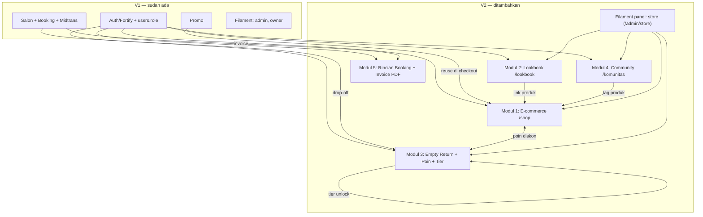

# 02 — Arsitektur Overview V2

> **Tujuan:** Gambaran high-level bagaimana 5 modul V2 disusun **di atas fondasi V1** (doc 01), layering backend, request lifecycle, penambahan struktur direktori, dan titik integrasi antar-modul. Detail per-bagian ada di doc 03–08.

---

## 1. Prinsip Arsitektur V2

1. **Additive, non-destruktif.** V2 = **tabel & kode baru**. Satu-satunya perubahan tabel V1 adalah ALTER enum `users.role` (tambah `admin_store`). Tidak ada tabel V1 di-drop / di-rename.
2. **Ikuti pola V1.** Custom PK, FK eksplisit, Constants untuk status, Service untuk logika bisnis, satu Filament panel per peran. (Lihat doc 01 §2–§6.)
3. **Pisahkan domain salon vs e-commerce.** Order salon (`order`) ≠ order produk (`product_orders`). Kategori salon (`kategori`) ≠ kategori produk (`product_categories`). Kota salon (`kota`, Treatwell) ≠ alamat kirim (`user_addresses`, api.co.id). Jangan dicampur.
4. **Reuse yang aman:** model `User`, `Promo`, `Salon`; integrasi Midtrans (pola, bukan kelas); middleware `role`/`active`; Fortify auth.
5. **Monolith Laravel.** Semua server-side dalam satu app Laravel 12. Satu komponen eksternal non-PHP: **Go scraper** (offline, sekali jalan untuk seed data — bukan service runtime).

---

## 2. Peta Modul V2



| Modul | Prefix route | Tabel inti | Reuse dari V1 |
|-------|--------------|-----------|---------------|
| 1 E-commerce | `/shop` | products, carts, product_orders, product_pembayaran, product_reviews, wishlists, user_addresses | User, Promo, Midtrans, DomPDF |
| 2 Lookbook | `/lookbook` | lookbooks, lookbook_slides, lookbook_items | products (Modul 1) |
| 3 Empty Return | `/empty-return`, `/akun/poin`, `/eksklusif` | empty_returns, user_points, point_transactions, exclusive_contents | User, Salon (drop-off), products |
| 4 Community | `/komunitas` | forum_threads, forum_replies, forum_likes, forum_bookmarks, community_points, user_badges | User, products (tag) |
| 5 Rincian Booking | `/akun/bookings/{kode}` | — (tidak ada tabel baru) | order, pembayaran, salon, DomPDF |

---

## 3. Layering Backend (target untuk V2)

```
HTTP Request
   │
   ▼
Route (routes/web.php)  ──[middleware: auth, verified, role:customer, throttle]──►
   │
   ▼
Controller (tipis)  — validasi request (FormRequest), orchestrasi, response/view
   │
   ▼
Service (logika bisnis)  — CartService, CheckoutService, OngkirService, PointService, …
   │                         transaksi DB, kalkulasi, panggilan API eksternal
   ▼
Model (Eloquent)  — relasi, scope, cast; Observer untuk side-effect (rating, poin)
   │
   ▼
Database (MySQL)  +  External: Midtrans, api.co.id  +  Cache (ongkir/katalog)  +  Queue (email/PDF)
```

**Aturan layering V2:**
- **Controller tipis.** Tidak ada query kompleks / kalkulasi uang di controller. Pindahkan ke Service. (Pengecualian: page sederhana read-only boleh query langsung dengan eager-load.)
- **Logika lintas-tabel & uang → Service.** Contoh: `CheckoutService` (subtotal + ongkir + promo + poin → grand_total + buat order + items dalam 1 `DB::transaction`).
- **Side-effect → Observer/Event.** Recalc rating produk saat review masuk; tambah poin komunitas saat thread dibuat; assign badge.
- **Validasi → FormRequest** (`app/Http/Requests/`). V1 belum banyak pakai ini; V2 sebaiknya pakai untuk request kompleks (checkout, submit review, submit empty return).
- **API eksternal → Service + cache + timeout.** `OngkirService` membungkus `Http::` ke api.co.id (timeout 5s, cache 1 jam per origin+dest+weight).

### Service layer yang direkomendasikan (detail di doc 05)
| Service | Tanggung jawab |
|---------|----------------|
| `OrderCodeGenerator` | Generate `VYG-S-XXXXXX` unik (cek collision). |
| `CartService` | Add/update/remove item, hitung subtotal & total berat. |
| `OngkirService` | Proxy api.co.id + cache + pembulatan berat. |
| `CheckoutService` | Rakit pesanan: subtotal+ongkir+promo+poin → `product_orders` + `product_order_items` (1 transaksi). |
| `ProductPaymentService` | Snap token, finish-verify, webhook (pola V1, tanpa konversi GBP). |
| `PointService` | Kredit/debit poin, log `point_transactions`, hitung tier. |
| `PromoService` | Validasi & terapkan promo (reuse `Promo` V1). |
| `InvoiceService` | Render Blade → DomPDF stream (booking & produk). |
| `BadgeService` / `CommunityPointService` | Gamification forum. |

---

## 4. Penambahan Struktur Direktori (rencana V2)

```
app/
├── Constants/        + ProductOrderStatus, ProductPaymentStatus, PointTier,
│                       EmptyReturnStatus, ForumStatus   (tambah ADMIN_STORE di UserRole)
├── Filament/
│   └── Store/         ← BARU: panel admin_store
│       ├── Resources/ ProductResource, ProductCategoryResource, ProductCollectionResource,
│       │              ProductOrderResource, ProductReviewResource, LookbookResource,
│       │              EmptyReturnResource, ExclusiveContentResource, ForumModerationResource
│       └── Widgets/   StoreStatsOverview, SalesChart, LowStock, PendingEmptyReturns
├── Http/
│   ├── Controllers/   + Shop, SkincareFinder, Wishlist, Cart, Ongkir, ProductCheckout,
│   │                    ProductOrder, ProductPayment, ProductReview, Lookbook,
│   │                    EmptyReturn, Point, ExclusiveContent, Forum, ForumReply, ForumInteraction
│   │                  (update AkunController: bookingDetail, downloadInvoice)
│   └── Requests/      ← BARU: CheckoutRequest, SubmitReviewRequest, EmptyReturnRequest, ThreadRequest
├── Models/            + 28 model V2 (doc 04)
├── Observers/         + ProductReviewObserver, EmptyReturnObserver(poin), ForumObserver(poin/badge)
├── Providers/Filament/+ StorePanelProvider   (daftarkan di bootstrap/providers.php)
└── Services/          + service2 di §3

config/                + ongkir.php
database/
├── migrations/        + 1 ALTER + 28 CREATE (doc 03)
└── seeders/           + FreshProductSeeder, AdminStoreSeeder, ForumCategorySeeder
resources/views/
├── shop/ lookbook/ empty-return/ komunitas/ akun/   (Blade)
└── pdf/               invoice-booking.blade.php, invoice-product.blade.php
scripts/scraper/       + fresh_scraper.go, config.json, output/   (Go, offline)
routes/web.php         + ~47 route V2
```

> Daftar nama persis (controller, model, resource) ikut PRD §4–§10. Doc 04–07 memetakan satu per satu.

---

## 5. Request Lifecycle — contoh kritis

### 5.1 Checkout produk (alur paling kompleks)
```
GET /shop/checkout
  → ProductCheckoutController@index: tampil alamat, item cart, ringkasan
POST /shop/ongkir/check (AJAX)
  → OngkirController → OngkirService (api.co.id, cached) → list kurir+tarif
POST /shop/checkout
  → CheckoutRequest (validasi alamat, kurir, layanan, promo?, poin?)
  → CheckoutService::place() di DB::transaction:
       hitung subtotal (snapshot harga & berat per item)
       + biaya_kirim (free jika ≥ 500k / tier Silver-Gold)
       - diskon promo (PromoService, reuse Promo V1)
       - potongan poin (PointService: 1 poin = Rp1.000, debit saldo)
       = grand_total
       buat product_orders (kode VYG-S-…, status=pending) + product_order_items
       kosongkan cart
  → redirect /shop/order/{kode}/payment
POST /shop/order/{kode}/payment/token
  → ProductPaymentService: Snap token (gross_amount = grand_total IDR, NO GBP convert)
  → simpan product_pembayaran (status=pending)
[frontend snap.pay]
POST /shop/order/{kode}/payment/finish  +  POST /midtrans/webhook (safety net)
  → verifikasi server-side → status order: paid → (admin) processing → shipped → delivered → completed
```

### 5.2 Empty Return → poin → tier → konten eksklusif (cross-module)
```
POST /empty-return/submit  → EmptyReturn (status=pending) + foto
[Admin Store approve di Filament]
  → EmptyReturnObserver / service: PointService::credit(user, poin)
       → point_transactions(type=earn) + user_points.saldo↑ + recalc tier
  → tier naik (Starter→Bronze≥50→Silver≥150→Gold≥300)
  → exclusive_contents difilter by min_tier user
  → saldo poin bisa dipakai di CheckoutService (potongan)
```

---

## 6. Titik Integrasi Antar-Modul (jangan terlewat)

Diturunkan dari PRD §4.1 (Phase 4 cross-module). Ini sumber bug tersembunyi kalau diabaikan:

| Integrasi | Modul | Implementasi |
|-----------|-------|--------------|
| Poin → Checkout | 3→1 | `CheckoutService` panggil `PointService::debit()` saat `poin_digunakan>0`. Validasi saldo cukup. |
| Tier → Free ongkir | 3→1 | `OngkirService`/`CheckoutService` cek tier: Silver 1×/bulan, Gold unlimited. Perlu hitung pemakaian bulan berjalan. |
| Tier → Konten eksklusif | 3→3 | `ExclusiveContentController` filter `where(min_tier ≤ user tier)`. |
| Wishlist → Lookbook | 1→2 | Tombol ♥ di product tag lookbook reuse `WishlistController@toggle`. |
| Forum tag → Produk | 4→1 | `forum_thread_tags` pivot → link ke `/shop/produk/{slug}`. |
| Empty Return → Badge | 3→4 | `BadgeService`: "Eco Warrior" setelah 5+ empty return approved. |
| Review → Badge | 1→4 | "Top Reviewer" setelah 10+ product_reviews. |
| Promo V1 → Checkout produk | V1→1 | Reuse model `Promo` + `scopeActive`; validasi `min_transaksi`, `stock`, `tipe_promo`, `diskon_max`. |

> **Saran urutan build (kurangi rework):** bangun `PointService` & tabel poin lebih awal (Phase 1/awal Phase 3) walau Empty Return penuh dikerjakan Phase 3, karena checkout (Phase 2) butuh hook poin. PRD menyarankan poin sebagai *placeholder* dulu di cart (§Sub-step 2.2.5) — itu OK, tapi sediakan interface `PointService` sejak awal.

---

## 7. Status State Machines (ringkas — detail di doc 05)

**Pesanan produk** (`product_orders.status`):
```
pending → paid → processing → shipped → delivered → completed
   └────────────────────────────► cancelled
                          paid ──► refunded
```
**Pembayaran produk** (`product_pembayaran.status`): `pending → success | failed | expired | refund`.
**Empty return** (`empty_returns.status`): `pending → approved → (picked_up) → received` | `rejected`.
**Tier poin**: `starter(0) → bronze(50) → silver(150) → gold(300)`.
**Forum thread/reply**: `published | hidden | deleted`.

> Buat masing-masing sebagai **Constants class** (pola `OrderStatus` V1), bukan string hardcoded.

---

## 8. Urutan Pengerjaan (ringkas — acuan PRD §18)

```
Phase 1 Foundation : ALTER role → 28 migration → 28 model → Go scraper+seed → Admin Store panel → DomPDF+ongkir config → navigasi
Phase 2 Core       : Modul 5 (Rincian Booking+Invoice) → Modul 1 (E-commerce, 10 sub-step)
Phase 3 Enhancement: Modul 2 Lookbook ∥ Modul 3 Empty Return ∥ Modul 4 Community  (paralel)
Phase 4 Polish     : cross-module → Admin Store dashboard → responsive → testing → audit → docs
```
Dependency wajib: **semua Phase 1 selesai sebelum Phase 2**. Migration harus urut induk→anak (doc 03).

---

*Berikutnya: `03-database-schema-migrations.md` — spesifikasi 29 migration, urutan, konvensi, index.*
