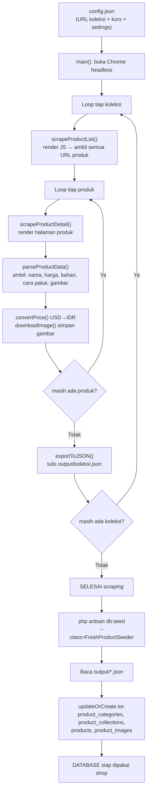

# 🤖 Penjelasan Scraper Fresh.com — VIYGO V2

> Penjelasan alur scraper dari awal: cara kerja, data apa yang diambil, dan ke mana datanya disimpan.
> File terkait: [`scripts/scraper/fresh_scraper.go`](../scripts/scraper/fresh_scraper.go),
> [`scripts/scraper/config.json`](../scripts/scraper/config.json),
> [`database/seeders/FreshProductSeeder.php`](../database/seeders/FreshProductSeeder.php)

---

## Gambaran Besar

```
config.json ──► fresh_scraper.go ──► output/*.json ──► FreshProductSeeder ──► Database
  (input)         (Go, scraping)       (hasil mentah)      (Laravel)         (tabel V2)
  pengaturan      ambil dari web        per kategori        baca JSON         products dll
```

Scraper adalah **program Go terpisah** dari Laravel. Tugasnya hanya satu: mengubah halaman
web fresh.com menjadi file JSON. Laravel (lewat seeder) yang memasukkan JSON itu ke database.

**Kenapa dipisah 2 tahap?**
Scraping itu lambat (butuh internet + render Chrome) dan idealnya dijalankan **sekali saja**.
Setelah JSON terbentuk, seeding ke DB bisa diulang kapan pun tanpa scraping lagi.

> [!NOTE]
> Untuk demo VIYGO V2 saat ini, Go tidak terpasang di mesin dev, jadi `output/*.json` diisi
> **data dummy terkurasi** (gaya fresh.com) — 40 produk. Scraper tetap berfungsi penuh saat
> dijalankan di mesin yang punya Go + Chrome untuk mengambil data asli.

---

## TAHAP 1 — Scraper (Go)

### Langkah 1: Baca konfigurasi
`main()` memanggil `loadConfig("config.json")`. File `config.json` berisi:

| Setting | Nilai | Fungsi |
|---------|-------|--------|
| `base_url` | `https://www.fresh.com` | URL dasar situs |
| `collections` | 16 URL koleksi | daftar halaman yang di-scrape |
| `usd_to_idr_rate` | `16200` | kurs konversi harga USD → IDR |
| `output_dir` | `output/` | folder hasil JSON |
| `image_dir` | `../../public/images/products/fresh/` | folder simpan gambar |
| `delay_ms` | `1500` | jeda antar produk (sopan, hindari diblok) |
| `headless` | `true` | Chrome tanpa jendela tampilan |

### Langkah 2: Siapkan folder + buka Chrome headless
- `os.MkdirAll` membuat folder `output/` dan `public/images/products/fresh/`.
- `newChromeContext()` menyalakan **Chrome tanpa tampilan (headless)** lewat `chromedp`.

> **Kenapa pakai Chrome, bukan ambil HTML mentah?**
> Fresh.com memuat produk pakai JavaScript. Kalau ambil HTML mentah (`http.Get`),
> produknya belum muncul. Chrome merender JS dulu → baru HTML-nya lengkap, baru di-parse.

### Langkah 3: Loop tiap koleksi → ambil daftar URL produk
Untuk setiap koleksi, `scrapeProductList()`:
1. Chrome buka halaman koleksi (mis. `.../collections/rose-collection`)
2. Tunggu `body` siap (`WaitReady`), ambil seluruh HTML (`OuterHTML`)
3. `goquery` (parser DOM mirip jQuery) mencari semua link `a[href*='/products/']`
4. Kumpulkan URL produk yang **unik** → hasil: daftar link produk koleksi itu

### Langkah 4: Loop tiap produk → ambil detail
Untuk setiap URL produk, `scrapeProductDetail()` me-render halaman, lalu `parseProductData()`
**mengambil data berikut** dari elemen DOM (CSS selector):

| Data | Selector di fresh.com | Field hasil |
|------|------------------------|-------------|
| Nama produk | `h1.product-title` | `nama` |
| Deskripsi | `.product-description` | `deskripsi` |
| Bahan aktif utama | `.key-ingredients` | `key_ingredients` |
| Bahan lengkap (INCI) | `.full-ingredients` | `full_ingredients` |
| Cara pemakaian | `.how-to-use` | `cara_pemakaian` |
| Harga (USD) | `.product-price` | `harga_usd` |
| ID produk | segmen terakhir URL | `fresh_product_id` |
| URL sumber | URL halaman | `fresh_url` |
| Gambar | `img.product-image` (semua) | `images[]` |

Lalu diolah:
- `parsePrice()` membersihkan `"$52.00"` → `52.0`, dikali kurs → `harga_idr = 842400`
- `downloadImage()` mengunduh tiap gambar ke `public/images/products/fresh/`,
  dan menyimpan **path relatif**-nya (`public/images/products/fresh/nama.jpg`) ke `images[]`
- `berat_gram` default `200` (untuk kalkulasi ongkir nanti)

> Setelah memproses 1 produk, scraper `sleep` `delay_ms` (1.5 detik) sebelum produk berikutnya.

### Langkah 5: Ekspor ke JSON
Setelah satu koleksi selesai, `exportToJSON()` menulis semua produk koleksi itu ke satu file,
mis. `output/rose-collection.json`.

---

## Di Mana Datanya Disimpan?

```
scripts/scraper/output/          ← hasil JSON (1 file per koleksi)
├── moisturizers.json
├── cleansers.json
├── serums-essences.json
├── toners.json
├── masks.json
└── lip-care.json

public/images/products/fresh/    ← gambar produk yang diunduh
├── black-tea-kombucha-essence-1.jpg
└── ...
```

**Bentuk satu produk di JSON:**
```json
{
  "fresh_product_id": "black-tea-kombucha-facial-treatment-essence",
  "fresh_url": "https://www.fresh.com/products/black-tea-kombucha-facial-treatment-essence",
  "nama": "Black Tea Kombucha Facial Treatment Essence",
  "kategori": "Serum & Essence",
  "koleksi": "Black Tea Collection",
  "deskripsi": "Essence fermentasi yang menghaluskan...",
  "key_ingredients": "Black Tea Ferment, Kombucha, Hyaluronic Acid",
  "harga_usd": 52.0,
  "harga_idr": 842400,
  "volume_ml": 150,
  "berat_gram": 200,
  "skin_type": "all",
  "skin_concern": "dehydration,dullness",
  "badge": "bestseller",
  "images": ["public/images/products/fresh/black-tea-kombucha-essence-1.jpg"]
}
```

---

## TAHAP 2 — Seeder (Laravel) → masuk Database

Jalankan:
```bash
php artisan db:seed --class=FreshProductSeeder
```

`FreshProductSeeder` melakukan:
1. Baca semua file `scripts/scraper/output/*.json`
2. Untuk tiap produk, `updateOrCreate` (idempotent — aman diulang) ke tabel:

| Data JSON | Masuk ke tabel | Catatan |
|-----------|----------------|---------|
| `kategori` | `product_categories` | unik by `slug` |
| `koleksi` | `product_collections` | unik by `slug` |
| `nama, harga_idr, key_ingredients, dll.` | `products` | unik by `fresh_product_id` |
| `images[]` | `product_images` | gambar pertama = `is_primary` |

**Kunci unik = `fresh_product_id`** → scraping/seeding ulang **tidak menggandakan** data,
hanya memperbarui yang sudah ada. Stok default di-set `100`, status `active`,
dan produk ber-badge `bestseller` otomatis jadi `is_featured`.

---

## Alur Lengkap dalam Satu Diagram



---

## 1 Produk Bisa Lebih dari 1 Tipe (Pivot)

Secara default tiap produk punya **1 kategori utama** (`products.id_product_category`).
Tapi kadang 1 produk masuk beberapa tipe sekaligus — mis. *Sugar Lip Treatment* termasuk
**Lip Care** sekaligus **Travel Size**. Untuk itu ada pivot many-to-many:

```
products  ──┐
            ├──►  category_product  ◄──┐  product_categories
            │     (id_product,         │
            │      id_product_category)│
```

- Tabel pivot: `category_product` (migration `..._000030_create_category_product_table.php`)
- Relasi: `Product::categories()` (semua tipe) & `ProductCategory::allProducts()`
- Kategori utama tetap dipakai untuk tampilan/breadcrumb; pivot untuk filter "produk ini juga muncul di tipe X"

**Cara memberi kategori tambahan:** di JSON, tambahkan field `kategori_lain` (array):
```json
{
  "nama": "Sugar Lip Treatment Advanced Therapy",
  "kategori": "Lip Care",
  "kategori_lain": ["Travel Size"],
  ...
}
```
Seeder otomatis membuat kategori "Travel Size" (kalau belum ada) dan menautkannya lewat pivot.
Hasilnya: `$product->categories` → `["Lip Care", "Travel Size"]`.

> Kalau `kategori_lain` tidak diisi, produk tetap punya 1 kategori (utama) di pivot — aman.

---

## 🏃 Cara Menjalankan Scraper — Langkah demi Langkah (LENGKAP)

Ada **2 jalur**. Pilih salah satu:
- **Jalur A** — kamu punya/instal Go + Chrome → ambil data ASLI dari fresh.com
- **Jalur B** — tanpa Go → pakai data dummy yang sudah disiapkan (tinggal seed)

---

> [!WARNING]
> **fresh.com diproteksi Akamai Bot Manager.** Request otomatis (curl/HTTP biasa) dibalas
> **403 Access Denied**. Headless Chrome pun kemungkinan besar ditantang/diblok, dan scraping
> situs komersial melanggar ToS mereka. Karena itu **data demo VIYGO memakai JSON dummy terkurasi
> di `output/`** (Jalur B) — itu yang sudah ter-seed & dipakai aplikasi. Jalur A di bawah hanya
> berlaku jika kamu punya akses/izin sah dan menyesuaikan selector ke DOM asli.

### JALUR A — Scraping data asli (butuh Go + Chrome, dan izin/akses sah)

#### Langkah A1 — Pasang Google Chrome
- Buka browser, ke **https://www.google.com/chrome/**, klik **Download**, install seperti biasa.
- (Kalau sudah ada Chrome, lewati langkah ini.)

#### Langkah A2 — Pasang Go
1. Buka **https://go.dev/dl/**
2. Unduh installer Windows: **`go1.2x.x.windows-amd64.msi`** (versi terbaru)
3. Jalankan installer, klik **Next → Next → Install** sampai selesai.
4. **Tutup semua terminal/PowerShell** yang terbuka (biar PATH ke-refresh).

#### Langkah A3 — Buka terminal di folder proyek
1. Buka **File Explorer**, masuk ke folder proyek: `Y:\VIYGO\au123-pk6m`
2. Klik kolom alamat di atas, ketik **`powershell`**, tekan **Enter**.
   → PowerShell terbuka tepat di folder proyek.
3. (Atau: buka VS Code → menu **Terminal → New Terminal**.)

#### Langkah A4 — Cek Go sudah terbaca
Ketik / **copy-paste** ini, tekan Enter:
```powershell
go version
```
Harus muncul `go version go1.2x.x windows/amd64`. Kalau muncul *"not recognized"*,
berarti perlu restart PowerShell atau restart komputer (PATH belum ke-load).

#### Langkah A5 — Masuk ke folder scraper
**Copy-paste**, Enter:
```powershell
cd scripts\scraper
```

#### Langkah A6 — Unduh dependency scraper
**Copy-paste**, Enter (sekali saja, butuh internet — unduh chromedp & goquery):
```powershell
go mod tidy
```
Tunggu sampai selesai (muncul kembali ke prompt tanpa error).

#### Langkah A7 — Jalankan scraper
**Copy-paste**, Enter:
```powershell
go run fresh_scraper.go
```
**Apa yang terjadi:** Chrome (tak terlihat) membuka tiap halaman koleksi fresh.com,
mengambil data produk, mengunduh gambar, lalu menulis file JSON.
Di layar akan muncul log seperti:
```
scrape collection: https://www.fresh.com/collections/rose-collection
  export 8 produk -> output/rose-collection.json
...
```
Tunggu sampai muncul: `selesai. Jalankan: php artisan db:seed --class=FreshProductSeeder`.

> ⏱️ Bisa makan beberapa menit (ada jeda 1.5 detik per produk). Biarkan jalan.

#### Langkah A8 — Cek hasilnya
- File JSON ada di: `scripts\scraper\output\*.json`
- Gambar ada di: `public\images\products\fresh\`

#### Langkah A9 — Kembali ke folder proyek
**Copy-paste**, Enter:
```powershell
cd ..\..
```

#### Langkah A10 — Masukkan data ke database
**Copy-paste**, Enter:
```powershell
php artisan db:seed --class=FreshProductSeeder
```
Muncul: `FreshProductSeeder selesai. Total produk: XX`. **Selesai!**

---

### JALUR B — Tanpa Go (pakai data dummy yang sudah ada)

Kalau belum mau pasang Go, file dummy sudah tersedia di `scripts\scraper\output\`
(40 produk). Cukup seed:

#### Langkah B1 — Buka terminal di folder proyek
File Explorer → folder `Y:\VIYGO\au123-pk6m` → ketik `powershell` di kolom alamat → Enter.

#### Langkah B2 — Jalankan seeder
**Copy-paste**, Enter:
```powershell
php artisan db:seed --class=FreshProductSeeder
```
Muncul: `FreshProductSeeder selesai. Total produk: 13`. **Selesai!**

> Mau menambah produk dummy sendiri? Buat/edit file `.json` di `scripts\scraper\output\`
> (ikuti format produk di atas), lalu ulangi Langkah B2. Aman diulang — tidak menggandakan
> data (kunci `fresh_product_id`).

---

### Verifikasi (jalur mana pun)

**Copy-paste** satu per satu di PowerShell (di folder proyek):
```powershell
php artisan tinker
```
Lalu di dalam tinker, ketik:
```php
App\Models\Product::count();          // jumlah produk
App\Models\ProductCategory::count();  // jumlah kategori
App\Models\ProductImage::count();     // jumlah gambar
exit
```

Atau langsung buka di browser setelah `php artisan serve`:
```
http://127.0.0.1:8000/shop
```
(halaman /shop baru aktif setelah Phase 2B dikerjakan)

---

## Ringkasan: Apa yang Harus Saya Lakukan?

| Situasi | Yang dibuka | Yang di-copy-paste |
|---------|-------------|---------------------|
| Punya Go + Chrome (data asli) | PowerShell di folder proyek | A5→A10: `cd scripts\scraper` → `go mod tidy` → `go run fresh_scraper.go` → `cd ..\..` → `php artisan db:seed --class=FreshProductSeeder` |
| Belum punya Go (data dummy) | PowerShell di folder proyek | `php artisan db:seed --class=FreshProductSeeder` |
| Cek hasil | PowerShell / browser | `php artisan tinker` lalu `App\Models\Product::count();` |

---

## Ringkasan Fungsi di `fresh_scraper.go`

| Fungsi | Tugas |
|--------|-------|
| `main()` | Entry point — baca config, loop koleksi |
| `loadConfig()` | Baca `config.json` |
| `newChromeContext()` | Nyalakan Chrome headless |
| `scrapeProductList()` | Ambil semua URL produk dari halaman koleksi |
| `scrapeProductDetail()` | Render 1 halaman produk |
| `parseProductData()` | Ekstrak data dari DOM → struct `ProductData` |
| `parsePrice()` | `"$52.00"` → `52.0` |
| `downloadImage()` | Unduh + simpan gambar, kembalikan path relatif |
| `exportToJSON()` | Tulis hasil ke `output/*.json` |

> [!IMPORTANT]
> Scraper hanya untuk **populasi data awal/demo**. Produk yang tampil di VIYGO adalah
> referensi dari fresh.com yang diadaptasi dengan harga IDR dan konteks lokal Indonesia.
